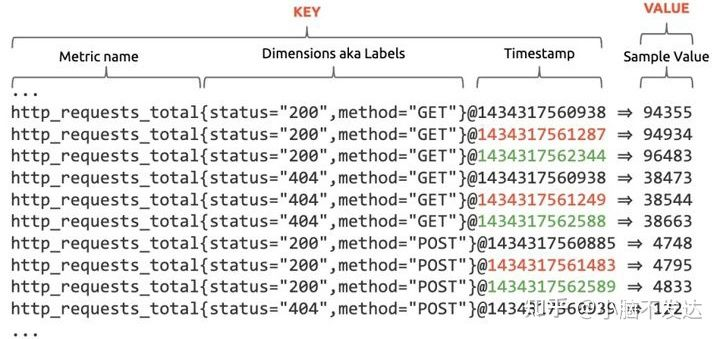
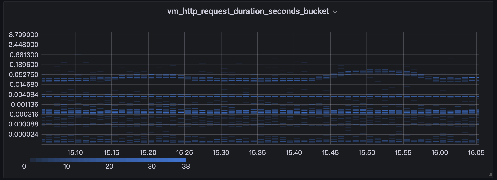
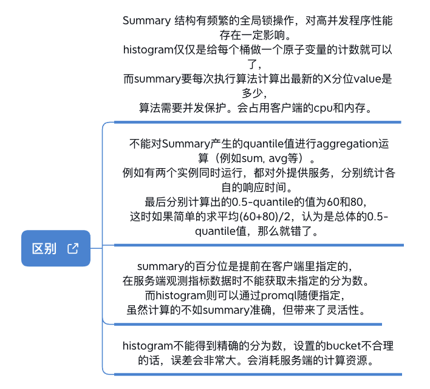

# 1.名词和概念

在介绍存储引擎的实现之前，我们先厘清一些基本概念。

## 1.1 time series

[wiki](https://zh.wikipedia.org/wiki/%E6%99%82%E9%96%93%E5%BA%8F%E5%88%97)内容：

> 时间序列（英语：time series）是一组按照时间发生先后顺序进行排列的数据点序列。通常一组时间序列的时间间隔为一恒定值（如1秒，5分钟，12小时，7天，1年），因此时间序列可以作为离散时间数据进行分析处理。时间序列广泛应用于数理统计、信号处理、模式识别、计量经济学、数学金融、天气预报、地震预测、脑电图、控制工程、航空学、通信工程以及绝大多数涉及到时间数据测量的应用科学与工程学。

（文中后续类似的格式都是引用其他文章，非原创）



通常一条time series数据包含以下内容：
* metric部分（通常叫做监控项，指标）
  - 由多个tag组成(tag又称为label，维度)
    * 每个tag又分为label name(维度)和label value(维度值)
  - 最常见的一个tag叫做 `__name__`，常称为metric name(监控项名称)，在VictoriaMetrics中称为metricGroup
* sample（采样）部分
  * sample也叫做 data point (采样点,数据点)
  * 分为timestamp和value两部分
  * timestamp是时间戳，代表采样的时间点
  * value是采样的值，通常用一个float64来表示

## 1.2 tsdb
tsdb即：**时间序列数据库 Time Series Database**。
整段引用简书作者jiangmo文章 [时间序列数据库 (TSDB)](https://www.jianshu.com/p/31afb8492eff) 的内容:

* 维基百科上对于时间序列的定义是`一系列数据点按照时间顺序排列`
* 时间序列数据就是历史烙印，具有不变性,、唯一性、时间排序性
* 时序数据是基于时间的一系列的数据。在有时间的坐标中将这些数据点连成线，往过去看可以做成多纬度报表，揭示其趋势性、规律性、异常性；往未来看可以做大数据分析，机器学习，实现预测和预警。
* 时序数据库就是存放时序数据的数据库，并且需要支持时序数据的快速写入、持久化、多纬度的聚合查询等基本功能。

### 数据写入的特点
* 写入平稳、持续、高并发高吞吐：时序数据的写入是比较平稳的，这点与应用数据不同，应用数据通常与应用的访问量成正比，而应用的访问量通常存在波峰波谷。时序数据的产生通常是以一个固定的时间频率产生，不会受其他因素的制约，其数据生成的速度是相对比较平稳的。
* 写多读少：时序数据上95%-99%的操作都是写操作，是典型的写多读少的数据。这与其数据特性相关，例如监控数据，你的监控项可能很多，但是你真正去读的可能比较少，通常只会关心几个特定的关键指标或者在特定的场景下才会去读数据。
* 实时写入最近生成的数据，无更新：时序数据的写入是实时的，且每次写入都是最近生成的数据，这与其数据生成的特点相关，因为其数据生成是随着时间推进的，而新生成的数据会实时的进行写入。数据写入无更新，在时间这个维度上，随着时间的推进，每次数据都是新数据，不会存在旧数据的更新，不过不排除人为的对数据做订正。

### 数据查询和分析的特点
* 按时间范围读取：通常来说，你不会去关心某个特定点的数据，而是一段时间的数据。
* 最近的数据被读取的概率高
* 历史数据粗粒度查询的概率高
* 多种精度查询
* 多维度分析

### 数据存储的特点
* 数据量大：拿监控数据来举例，如果我们采集的监控数据的时间间隔是1s，那一个监控项每天会产生86400个数据点，若有10000个监控项，则一天就会产生864000000个数据点。在物联网场景下，这个数字会更大。整个数据的规模，是TB甚至是PB级的。
* 冷热分明：时序数据有非常典型的冷热特征，越是历史的数据，被查询和分析的概率越低。
* 具有时效性：时序数据具有时效性，数据通常会有一个保存周期，超过这个保存周期的数据可以认为是失效的，可以被回收。一方面是因为越是历史的数据，可利用的价值越低；另一方面是为了节省存储成本，低价值的数据可以被清理。
* 多精度数据存储：在查询的特点里提到时序数据出于存储成本和查询效率的考虑，会需要一个多精度的查询，同样也需要一个多精度数据的存储。

(结束引用其他文章的内容)


## 1.3 监控数据的类型
从用户（业务）的角度说，time series数据中的value通常有以下四种用法：

### Gauge 时刻量
总是直接记录当前时刻的值，这个值与其他时间段无任何关联，仅仅只是当前状态而已。
常用的指标有：

* 当前CPU使用率
* 当前内存使用率
* 某种瞬时的状态

在上报数据的过程中，少量的Gauge类型数据丢失影响不大。相当于只是数据采样的频率降低了。

服务进程重启也不会对时刻量的上报产生影响。

### Counter 累计量
从服务启动一直累加到现在的值。累计量是永远在不断增加的。
常用的指标有：

* 总请求量
* 总错误量

此外：
* 通常把t时刻的累计量减去t-1时刻的累计量，得到一个两个时刻之间的增量。然后展现增量的变化情况。
  - promql中常见用法：`rate(http_request_total)[1m]*60`
* 如果服务重启，累计值会重新从0开始计数。通常promql等查询引擎会识别出这种情况，会把重新开始的时刻分成两个段来分别计算增量。从计算增长率的角度来说，counter类型变零不会产生影响。
* counter类型监控项的名称通常以 `_total` 来结尾。

为什么counter类型不仅仅只是上报两次采样之间的增量，而是上报当前累计后的总值呢？
上报总值的好处在于，偶尔的丢失Counter类型的数据，不会导致增长率统计曲线发生变化，仅仅只是等同于采样频率降低。相反，delta增量上报如果丢失数据，必然影响准确性。

此外，counter类型使用不断累加的方式，也方便做降采样的计算：

* 如果只保存delta，则计算更大粒度的汇总量只能做这个周期数据的累加运算；
* 而采用一直递增的值，只需要取更大粒度的时间窗口的最后一个data point即可。

从数据压缩的角度来说：连续的值，方便使用delta-delta模式的压缩算法，每个数值可以以更小的bit位来存储。

### Histogram 分桶汇总

分桶汇总上报组合时刻量和累计量的格式，通过上报多条数据来达到某个指标的分区间观测。

分桶上报通常用于展示这样的指标：

* 时延分布情况（通常用柱图或热力图heatmap来体现）

* 数据的分布情况(例如每个请求的带宽占用分布)
  (以下是一个展示延迟分布的例子)

  

分桶汇总的使用流程如下：
1. 使用上报api的时候，用户需要指定数据的分桶区间：
    完整例子代码：[github](https://github.com/prometheus/client_golang/blob/main/examples/random/main.go)
```go
import "github.com/prometheus/client_golang/prometheus"

var rpcDurationsHistogram = prometheus.NewHistogram(prometheus.HistogramOpts{
			Name:    "rpc_durations_histogram_seconds",
			Help:    "RPC latency distributions.",
			Buckets: prometheus.LinearBuckets(*normMean-5**normDomain, .5**normDomain, 20),
		})  //也可以用一个 []float64 来表示分桶

func init(){
    prometheus.MustRegister(rpcDurationsHistogram)
}

func xxx() {
	start := time.Now()
	//do something
	rpcDurations.WithLabelValues("normal").Observe(time.Since(start).Seconds())
}

```

2. 上报过程中会产生以下值：
  * 对每个采样点进行统计（并不是一段时间的统计），打到各个桶(bucket)中
  * 对每个采样点值累计和(sum)
  * 对采样点的次数累计和(count)
3. 上报API会把分桶内的数据转换为多个counter和gauge:
  * [basename]_bucket{le=“上边界”}, 这个值为小于等于上边界的所有采样点数量
  * [basename]_sum
  * [basename]_count

​    eg: 假设某个histgram设置了10个分桶，则上报的时候会上报12条time series数据

4. 可以通过`histogram_quantile`函数来计算初略的数据分布
5. 可以在grafana中配置heatmap来展示完整的数据分布情况
    参考：[grafana中如何展示prometheus的延迟分布数据？](https://www.cnblogs.com/ahfuzhang/p/15354324.html)

### Summary

在分布式环境中，Summary用处不大。

Histgram可以理解为能最终汇总的初略分桶的用于观测数据分布的方法。

Summary则是仅仅适合单个节点的，可以更加细致的观测数据分布的方法。

同时，Summary的计算成本很高，会增加单节点的负载。

不推荐使用，此处不再详细介绍。


下面是一些histogram和summary的对比：

* 区别：
  * Summary 结构有频繁的全局锁操作，对高并发程序性能存在一定影响
  * Histogram 仅仅是给每个桶做了一个原子变量的计数器就可以了，而 summary 要每次执行算法计算出最新的 X 分位的 value 是多少，算法需要并发保护。会占用客户端的 CPU 和内存。
  * 不能对 Summary 产生的 quantile 值进行 aggregation 运算（例如 sum, avg 等）。例如有两个实例同时运行，都堆外提供服务，分别统计各自的响应时间。最后分别计算出的 0.5 - quantile 的值为 60 和 80，这时如果简单的求平均 (60+80)/2，认为是总体的 0.5-quantile 值，那么就错了。
  * Summary 的百分位是提前在客户端里指定的，在服务端观测指标数据时，不能获取未指定的分位数。而 histogram 则可以通过 promql 随意指定，虽然计算得不如 summary 准确，但带来了灵活性。
  * histogram 不能得到精确的分位数，设置的 bucket 不合理的话，误差会非常大。会消耗服务端的计算资源。



| 类型 | Histogram | Summary |
| ---- | ---- | ---- |
| 客户端性能耗费 | 较低，只需增加 counter | 较高，需聚合计算百分位数 |
| 服务端性能耗费 | 较高，需要聚合计算 | 较低，无需再聚合计算 |
| 时间序列数据 | 每个 bucket 一个 | 每个百分位数一个 |
| 百分位数计算误差 | 依赖于桶区间粒度和数据分布，受限于桶的数量 | 受限于百分位数值本身 |
| 聚合 | 查询时可以灵活聚合数据 | 查询时不建议做聚合，包氛围数无法做聚合，只能做均值和加和的聚合 |
| 数据的时间范围 | 可在查询时灵活定制 | 活动窗口内，窗口大小在声明 Metrics 后不可更改，即查询时也不可更改 |
| 适用场景 | 客户端监控，组件在系统重较多，不太关心精确的百分位数值 | 服务端监控，组件在系统中唯一或只有个位数，需要知道比较准确的百分位数值（如性能优化场景） |


(图片引用自：《[Prometheus最佳实践 Summary和Histogram](https://www.jianshu.com/p/ccffd6b9e3d1)》)

## 1.4 (应用程序中的)观测点

原始而朴素的观点是：可以在程序源码的各个关键位置`打点上报`，由此来发现程序中的缺陷、异常，或者用于性能调优，业务指标统计等。那么在程序源码的某些位置加的监控代码，就是**观测点**:
* 观测点的位置和数量是由应用程序开发者决定的
* 通过把基础的观测能力封装到框架中来简化监控数据上报是个好办法
  - 例如：主流rpc框架中的主调监控/被调监控等大类，大类中又有请求量、失败量等

(按照过时的观点，观测点又称为埋点、打点)

## 1.5 采样率

把同样的time series数据存储到TSDB的周期，称为采样率（采样频率）。

prometheus中，默认的采样率是15秒一次。即同一个time series，一分钟产生4个data point。

理论上，采样率越高，在数据采集的过程中丢失数据的概率就越低，且用户端观察到最新数据的周期就会越短。

但是：

* 采样率过高会导致TSDB的存储压力增大，查询的性能也会降低
* TSDB为了提高写入吞吐量，使用了大量合并写的机制，导致数据的实时性不可能太高。在vm体系中，理论延迟时间至少是2.2秒。


## 1.6 MDD 概念

MDD 即 Metrics-Driven Development，指标驱动的软件开发。

Metrics 数据不仅仅只是用于观测软件系统，同时也是一种驱动软件系统不断改进的开发方式。

具体请参考文章：[Metrics-Driven Development](https://www.infoq.com/articles/metrics-driven-development/)
