# 2. 监控领域的相关存储引擎介绍

## 2.1 监控数据的特点

* 监控数据的特点
  * 重写轻读(Write a lot, read tiny)
  * 以聚合分析为主，几乎不存在针对单 Data Point 的点查场景
  * 越老的数据价值越低，而应用通常只读取最近发生的数据
  * Writes are vertical, reads are horizontal (垂直写，水平读)
  * 监控数据的格式
    * lables
      * Timestamp list
      * data list

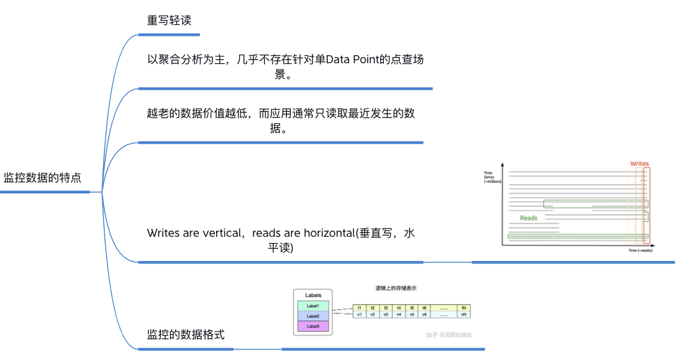

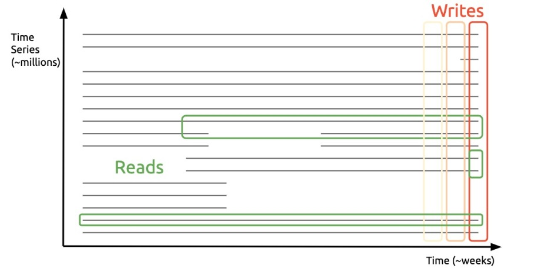

## 2.2 druid

以下分析 Druid  存储引擎的特点：

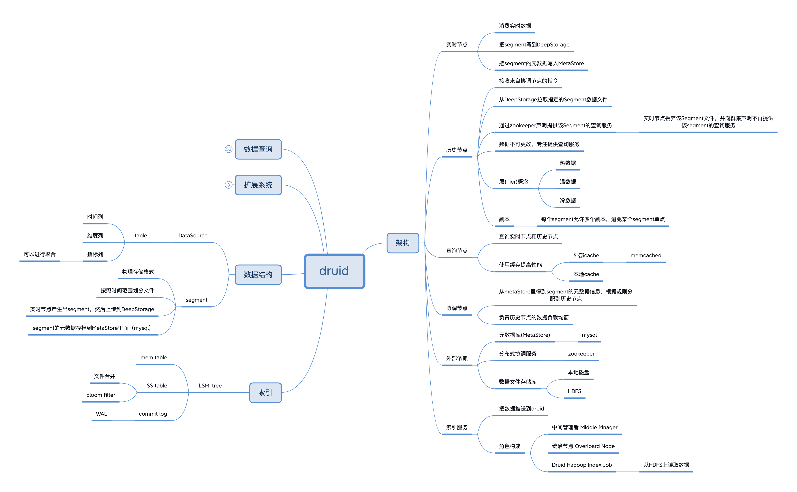
### 2.2.1 架构
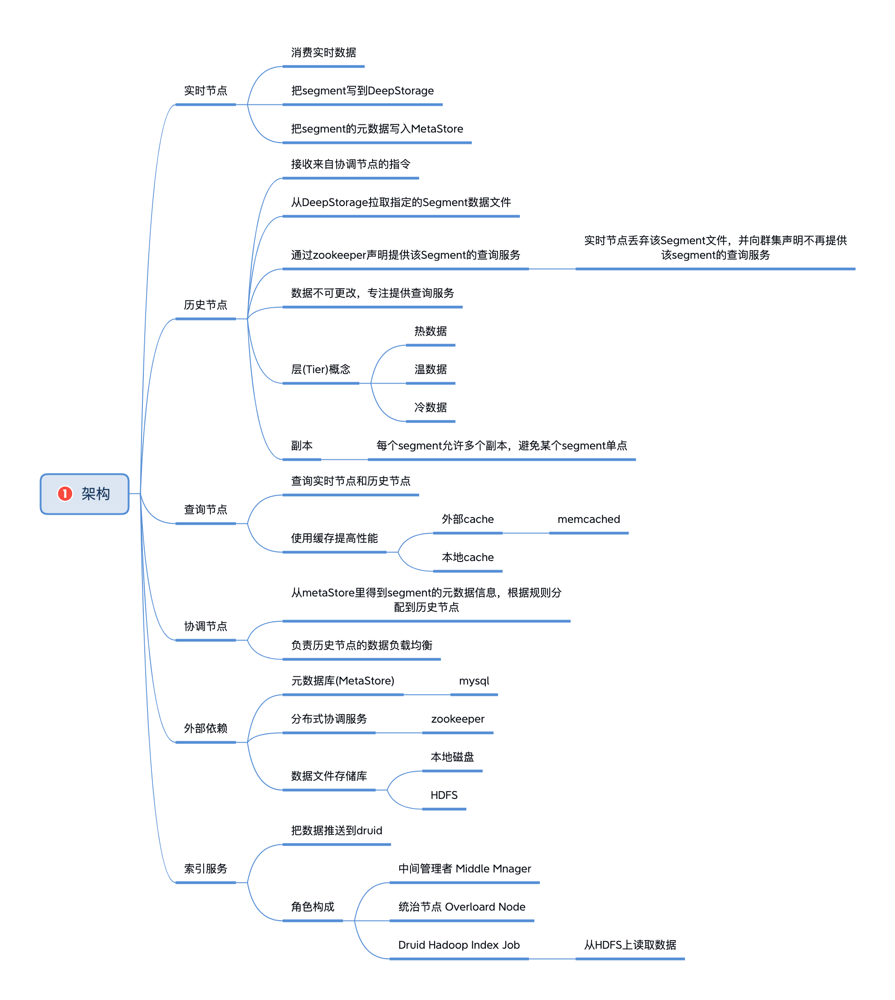
### 2.2.2 索引
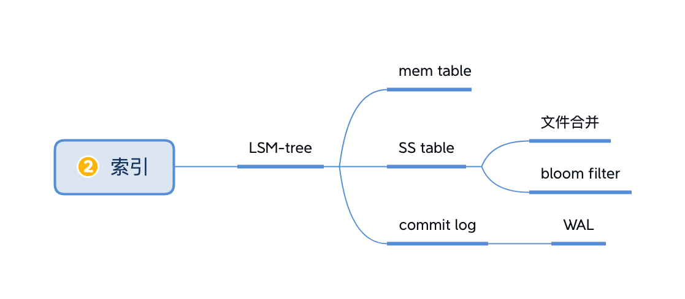
### 2.2.3 数据结构
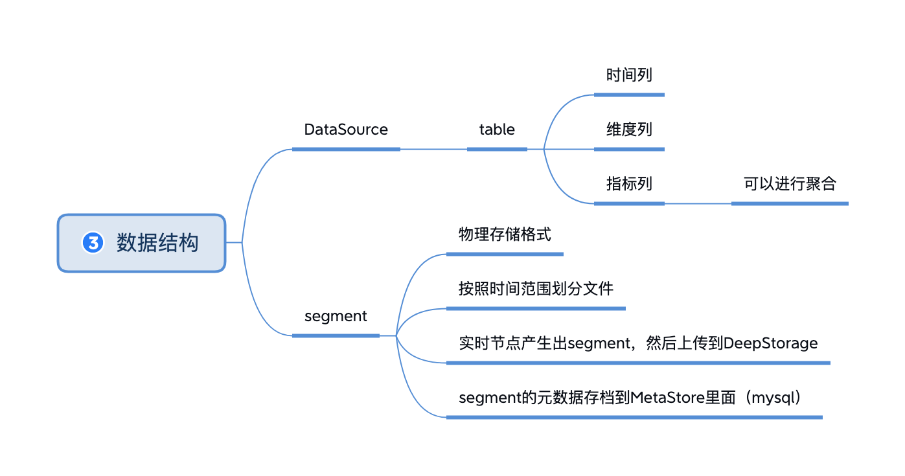
### 2.2.4 扩展系统
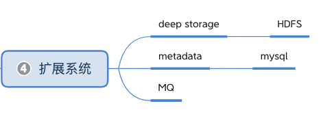
### 2.2.5 数据查询
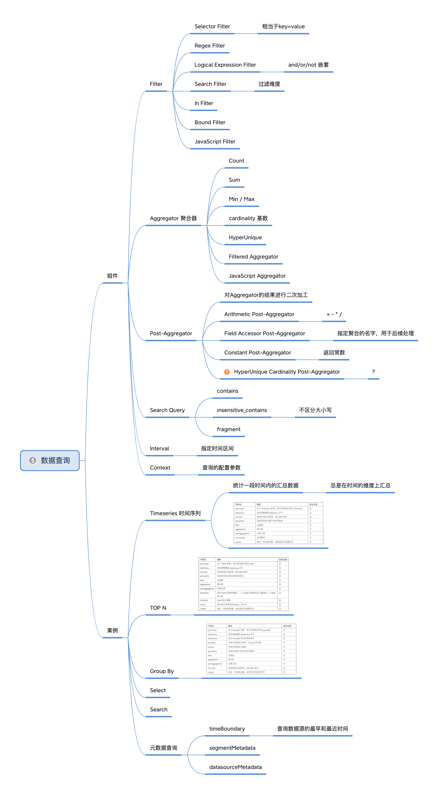

## 2.3 facebook gorilla

以下分析 Facebook的关于监控系统的论文中提到的 gorilla 系统:

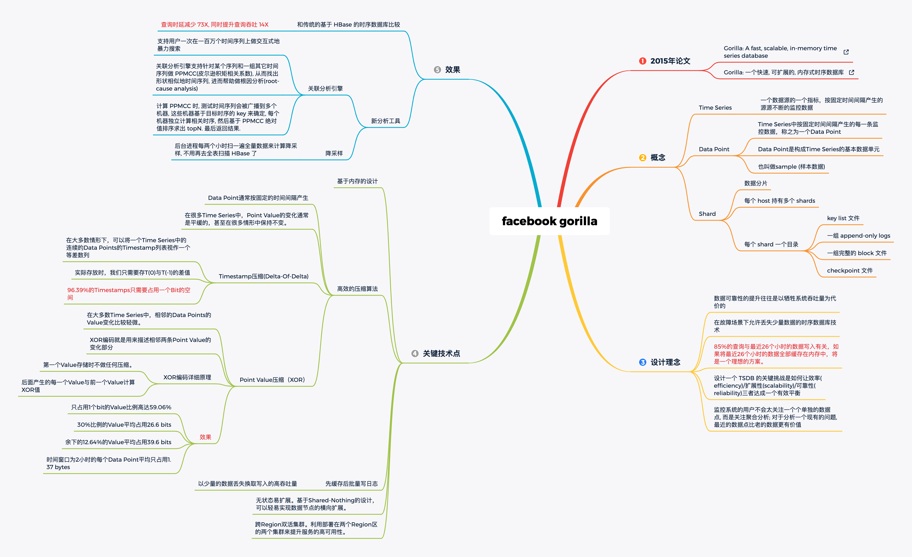

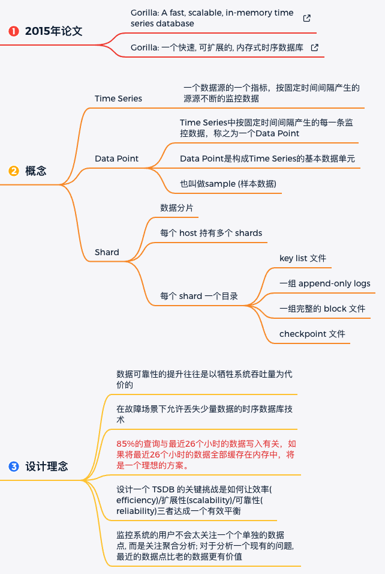

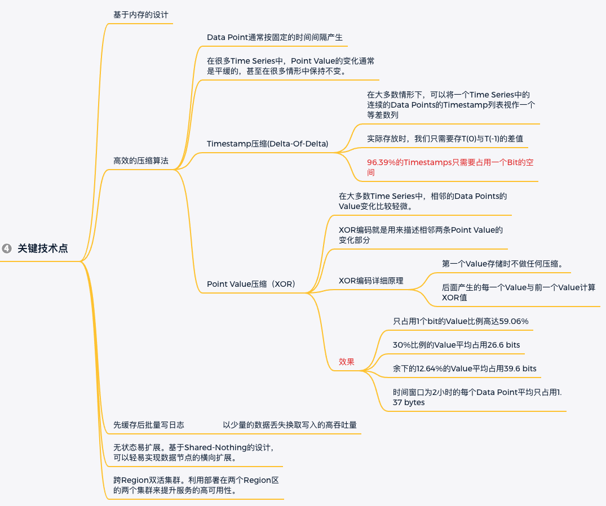

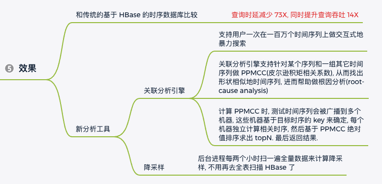

* 论文文章外网地址：[Gorilla: 一个快速, 可扩展的, 内存式时序数据库](https://chienlungcheung.github.io/2020/12/05/Gorilla-%E4%B8%80%E4%B8%AA%E5%BF%AB%E9%80%9F-%E5%8F%AF%E6%89%A9%E5%B1%95%E7%9A%84-%E5%86%85%E5%AD%98%E5%BC%8F%E6%97%B6%E5%BA%8F%E6%95%B0%E6%8D%AE%E5%BA%93/)

此处总结gorilla系统的特点：

1. 首先，通过深入分析数据特性，使用特性等，系统设定了合理的目标；

     * 85%的查询都只涉及过去26小时的数据
     * 设定的保存目标：26小时
     * 设定的查询性能：4000次每秒
2. 对于海量数据，如果不能采样而必须要全量存储，那么数据如何组织如何压缩就很重要。这里算是对空间复杂度的控制；
3. 内存结构+文件结构，最终实现了一个高效的TSDB存储和查询引擎（就像现在prometheus做的）；
4. 根据监控数据的特点，不同的监控项之间通常没有什么关联关系，因为分而治之就相对别的场景更加容易。在高可用问题上，通过副本来解决；容灾调度上，以shard node为单位来处理。

## 2.4 prometheus存储引擎

prometheus的设计思路来源于Facebook 的 Gorilla项目。

存储引擎的介绍有以下文章：

* 《[Prometheus时序数据库-磁盘中的存储结构](https://my.oschina.net/alchemystar/blog/4965684)》
* 《[Prometheus 存储引擎分析](https://liujiacai.net/blog/2021/04/11/prometheus-storage-engine/)》

* 先写内存，再合并写到磁盘

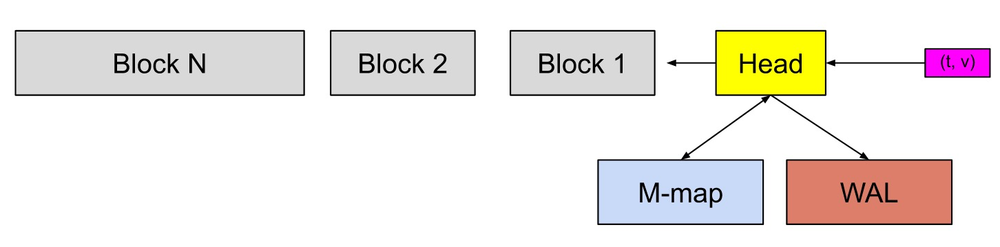

* block概念
  * 每个block就是一个独立的小型数据库
  * 最近的一个block保存2小时的数据
  * block会通过compactor进行合并
    * 合并只会进减少索引的大小，不会导致数据部分的大小发生变化
  * block文件夹的内容
    * meta.json: 保存block的元信息
    * index文件: 索引文件
    * [tombstones](https://github.com/prometheus/prometheus/blob/release-2.33/tsdb/docs/format/tombstones.md)文件：删除记录会保存在单独的逻辑文件 `tombstone` 当中
    * chunks目录：包含多个chunks文件
      * 命名为：000001,000002等
      * 每个chunks文件最大512mb
      * chunks文件包含了多个chunk
      * 进程使用mmap来映射整个chunks文件
    * wal目录
* chunk概念
  * 一个[chunks](https://github.com/prometheus/prometheus/blob/release-2.33/tsdb/docs/format/chunks.md)文件包含多个chunk
  * chunk文件中包含time stamp和value
  * 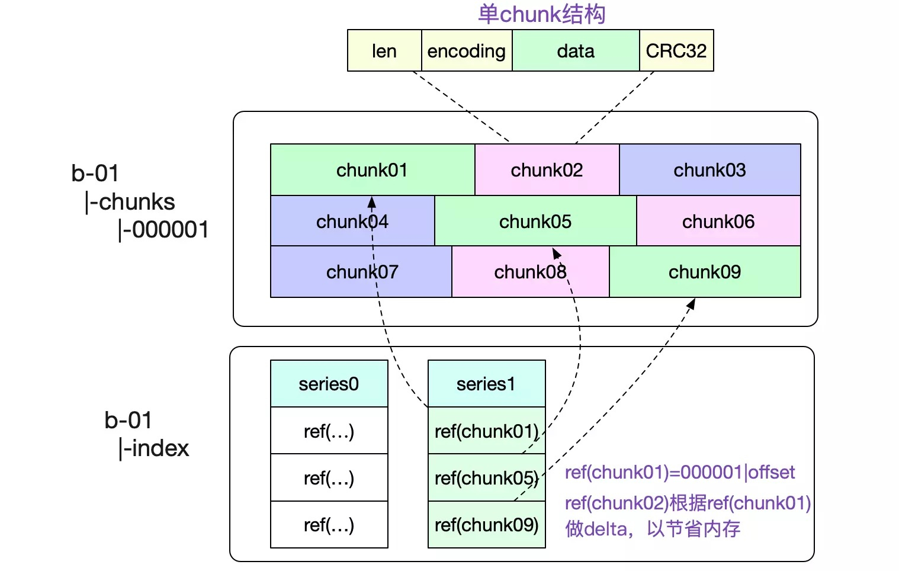
* [index](https://github.com/prometheus/prometheus/blob/release-2.33/tsdb/docs/format/index.md)概念
  * index中是各种索引
    * 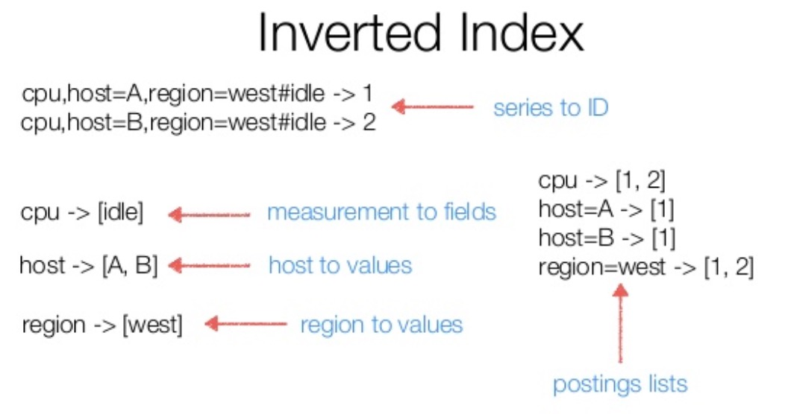

  * index文件包含的内容
    * Symbol Table
      * 排序且不重复的字符串表
      * 存储每个label name 或 label value的值
      * 相当于所有出现过的字符串的字典
    * Series
      * 时间序列的完整数据
      * 包含所有标签的引用
        * 通过ID引用`Symbol Table`中的label name
        * 通过ID引用`Symbol Table`中的label value
      * time series的时间戳对应的最小时间戳和最大时间戳
      * time series的value对应的起止位置
    * Lable Index: 所有的label name在符号表中的引用信息
    * Posting: 记录单调递增的time series的列表
      * 猜测是递增的数据能够带来更高的压缩率
    * Postings Offset Table
      * key为label name + label value的组合
      * value指向Series表中的起止位置
      * 最终：可以通过这里的label name + label value搜索到所被包含的time series
      * 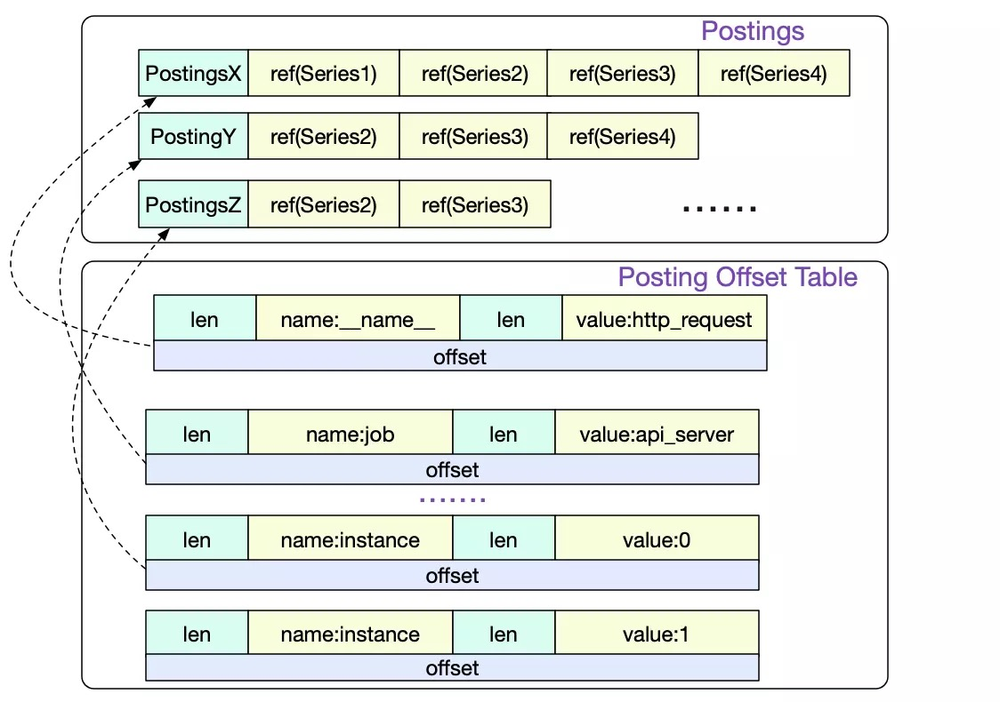
    * TOC(Table Of Contents)
      * 以上的各个索引表的具体内容

* [WAL](https://github.com/prometheus/prometheus/blob/release-2.33/tsdb/docs/format/wal.md)（Write-ahead log）概念
  * 为了确保 Prometheus 发生崩溃或重启时能够恢复数据，Prometheus 启动时会通过预写日志（write-ahead-log(WAL)）重新记录，从而恢复数据。预写日志文件保存在 `wal` 目录中，每个文件大小为 `128MB`。wal 文件包括还没有被压缩的原始数据，所以比常规的块文件大得多。一般情况下，Prometheus 会保留三个 wal 文件，但如果有些高负载服务器需要保存两个小时以上的原始数据，wal 文件的数量就会大于 3 个。

总结：

* 两小时内的数据会写入内存和WAL
* 超过两小时后写入磁盘成为一个block
* 合并机制把小的block合并为大的block
* chunks文件存储timestamp和value
* index文件存储索引
  * 存在以下类型的索引
    * time series -> chunk偏移量
    * Label name -> 符号表
    * Label name + label value -> time series list
* 存储原理上与VM类似：
  * 先写内存表，积累一定量后再写磁盘
  * 数据不断merge
  * 索引和数据分离
* 与vm不同的点有：
  * 使用了WAL（一定程度上影响了性能，效果也没好太多）
  * 未使用压缩算法
  * 索引更复杂
  * VM的索引的周期更长（只有一个整体的表，不像prometheus一样有很多独立的block作为小数据库）
