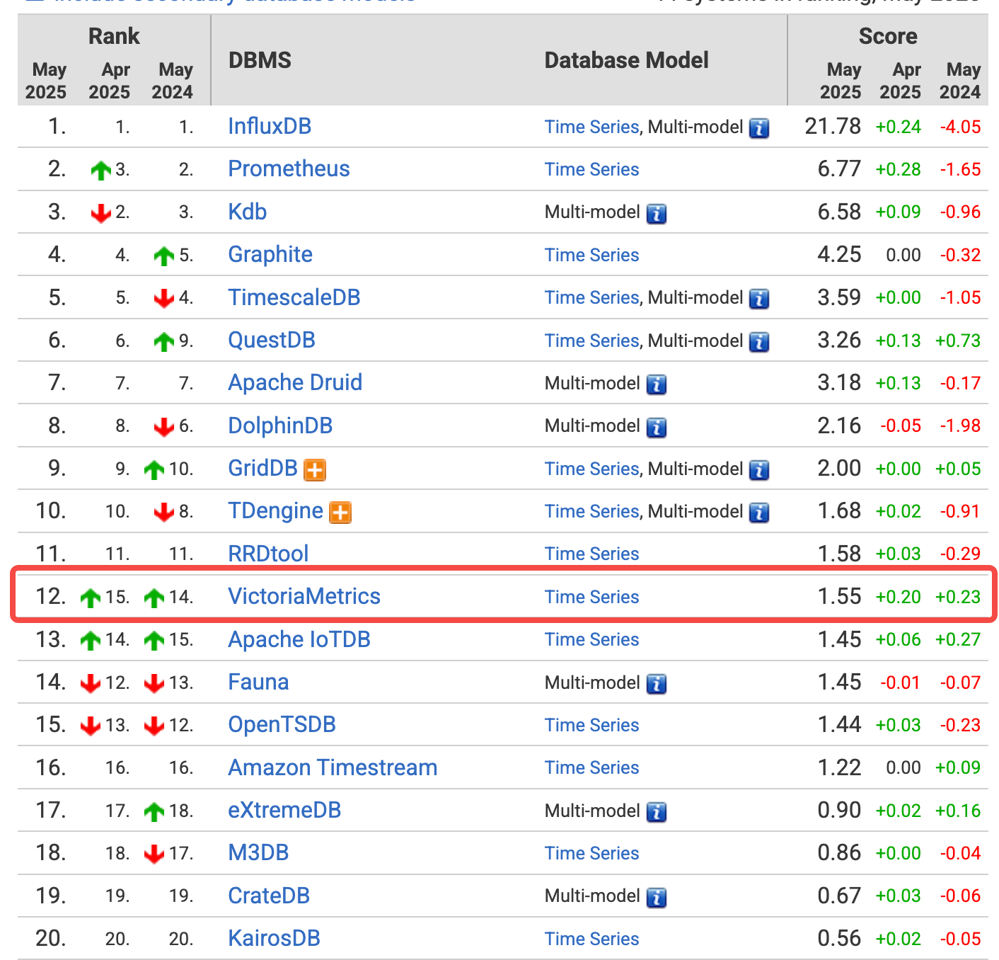

# 3.VictoriaMetrics的背景知识
db-engines上的时序数据库排名: https://db-engines.com/en/ranking/time+series+dbms

虽然目前VM的世界排名只在第12位，但vm中大量的数据与世界排名第一的 influxDB 进行比较，并且给出了性能高出10倍的测试数据。

## 3.1 VM的官方广告

## 3.2 VM的组件介绍

群集版的架构如下：

## 3.3 卖点

## 3.4 所宣传的性能数据

性能对比文章：https://faun.pub/victoriametrics-creating-the-best-remote-storage-for-prometheus-5d92d66787ac

* 初步测试表明，与 Prometheus 相比，VictoriaMetrics 使用的存储空间减少了 10 倍，每个数据点 2.0–0.4 字节
* 单个vmstorage服务在 8xCPU 服务器上每秒接受多达 400 万个数据点。
  - 每核每秒处理50万个data point
  - prometheus引擎实测的数据是单核3~5万个数据点，see: [thanos receiver压测结果分享](https://www.cnblogs.com/ahfuzhang/p/15320082.html)
* 单个vmselect服务每秒可在 8xCPU 服务器上扫描多达 5 亿个数据点。
  - 平均单核，每秒扫描 6250万个 data point
* 与 TimescaleDB相比，VictoriaMetrics 使用的存储空间减少了 70 倍

## 3.5 VictoriaMetrics中的名词

* Time series
    - Metric
      * tag
        * key
        * value
    - Metric group (Label name 为 `__name__` 的 label value，监控项的名称)
    - sample
       * Timestamp
       * value
* tsid
  - 每个唯一的metric对应一个唯一的tsid
  - tsid包含以下字段
    * ProjectID
    * AccountID: 这两个字段用于区分租户
    * JobID: 第0个tag的hash值
    * InstanceID: 第1个tag的hash值
    * Metric id: 递增分配的唯一uint64的id

## 3.6 重要的依赖组件

* fast cache: [介绍一个golang库：fastcache](https://www.cnblogs.com/ahfuzhang/p/15840313.html)
* Uint64set: 模仿RoaringBitmap的实现，see：[vm中仿照RoaringBitmap的实现：uint64set](https://www.cnblogs.com/ahfuzhang/p/15900852.html)

* ZSTD: facebook开源的压缩算法， see: [介绍一个golang库：zstd](https://www.cnblogs.com/ahfuzhang/p/15842350.html)

* Fasthttp: 由 valyala 实现的目前 golang 生态中最快的 http 服务器

