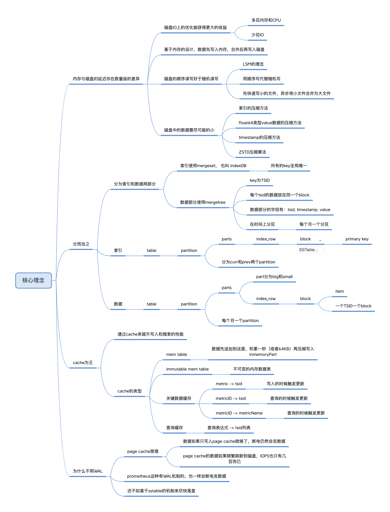

# 4. VM存储引擎的设计

## 4.1 LSM概念
引用wikipedia中的词条：[Log-structured_merge-tree](https://en.wikipedia.org/wiki/Log-structured_merge-tree)

> 在计算机科学中，日志结构的合并树（也称为LSM 树或LSMT [1]）是一种具有性能特征的数据结构，这使得它对于提供对具有高插入量的文件的索引访问很有吸引力，例如事务日志数据。LSM 树与其他搜索树一样，维护键值对。LSM 树将数据保存在两个或多个独立的结构中，每个结构都针对其各自的底层存储介质进行了优化；数据在两个结构之间有效地批量同步。
> LSM 树的一个简单版本是两级 LSM 树。[2] 正如Patrick O'Neil所描述的，两级 LSM 树包含两个树状结构，称为 C 0和 C 1。C 0更小并且完全驻留在内存中，而 C 1驻留在磁盘上。新记录被插入到内存驻留的 C 0组件中。如果插入导致 C 0组件超过某个大小阈值，则从 C 0中删除一个连续的条目段并合并到 C 1在磁盘上。LSM 树的性能特征源于这样一个事实，即每个组件都根据其底层存储介质的特性进行了调整，并且数据可以使用类似于归并排序的算法以滚动批次的方式有效地跨介质迁移。
>
> 实践中使用的大多数 LSM 树都采用多个级别。级别 0 保存在主存储器中，并且可以使用树来表示。磁盘上的数据被组织成排序的数据运行。每次运行都包含按索引键排序的数据。运行可以在磁盘上表示为单个文件，也可以表示为具有非重叠键范围的文件集合。要对特定键执行查询以获取其关联值，必须在 0 级树中进行搜索，并且每次运行时也要进行搜索。
> 一个特定的键可能会在多次运行中出现，这对查询意味着什么取决于应用程序。一些应用程序只需要具有给定键的最新键值对。一些应用程序必须以某种方式组合这些值以获得正确的聚合值以返回。例如，在Apache Cassandra中，每个值代表数据库中的一行，并且该行的不同版本可能具有不同的列集。[3]
> 为了降低查询成本，系统必须避免运行次数过多的情况。

> 将每一列存储在类似于日志结构化合并树 (LSM) 的数据结构中。与类似 B 树的数据结构相比，这减少了添加/扫描排序值时的随机 I/O 。这加快了 HDD 上的存储速度。LSM 文件是不可变的。这简化了制作快速快照和备份的过程。LSM 与 B-tree 相比有一个缺点——当较小的文件合并到较大的文件中时，存储的数据会被多次重写。这会浪费磁盘带宽，但 ClickHouse 实践表明这是一个很好的折衷方案。

## 4.2 sstabe概念

> SSTable(Sorted String Table)是Bigtable内部用于数据的文件格式，它的格式为文件本身就是一个排序的、不可变的、持久的Key/Value对Map，其中Key和value都可以是任意的byte字符串。使用Key来查找Value，或通过给定Key范围遍历所有的Key/Value对。每个SSTable包含一系列的Block（一般Block大小为64KB，但是它是可配置的），在SSTable的末尾是Block索引，用于定位Block，这些索引在SSTable打开时被加载到内存中，在查找时首先从内存中的索引二分查找找到Block，然后一次磁盘寻道即可读取到相应的Block。还有一种方案是将这个SSTable加载到内存中，从而在查找和扫描中不需要读取磁盘。

> 在新数据写入时，这个操作首先提交到日志中作为redo纪录，最近的数据存储在内存的排序缓存memtable中；旧的数据存储在一系列的SSTable 中。在recover中，tablet server从METADATA表中读取metadata，metadata包含了组成Tablet的所有SSTable（纪录了这些SSTable的元数据信息，如SSTable的位置、StartKey、EndKey等）以及一系列日志中的redo点。Tablet Server读取SSTable的索引到内存，并replay这些redo点之后的更新来重构memtable。

> 在读时，完成格式、授权等检查后，读会同时读取SSTable、memtable（HBase中还包含了BlockCache中的数据）并合并他们的结果，由于SSTable和memtable都是字典序排列，因而合并操作可以很高效完成。

## 4.3 VM的设计思路来自click house

[VictoriaMetrics — creating the best remote storage for Prometheus](https://faun.pub/victoriametrics-creating-the-best-remote-storage-for-prometheus-5d92d66787ac)

一开始，团队部署了clickhouse来做时序数据的存储和分析，设计了多张表来组织time series数据，并与grafana等多个开源组件打通，这些组件也都开源了。

再后来，他们干脆自己开发了一个TSDB存储引擎。

### 4.3.1 索引部分：mergeset结构

顾名思义，这是一个可以merge(合并)的set结构：

1. 首先是set数据结构

   * 只存储索引键：通常，在索引中把key+value顺序存储

   * 所有的索引键都是唯一的

   * 支持范围查找
2. table概念
   * 目前indexDB中只有一个table
   * 包含了可追加的 mem table
   * 包含了curr 和 prev 两个 partition
   * 对应着 indexdb 目录
3. partition概念
   * 以支持的时间范围(`-retentionPeriod`参数指定)为周期，默认31天
   * 每31天切换一次索引
   * 只支持最近的两个partition，是数据存储周期的两倍
   *  也就是说，默认31天的存储周期的话，索引支持查询最多62天内的索引键
   *  包含了多个只读的parts
   * 对应着以unixnano() 为时间戳的十六进制字符串命名的文件夹
     * 值保留最新的两个文件夹

4. part 概念
   *  part 都是只读的
   * 有两个类型的part
     * inmemoryPart
     * filePart
   *  一个part下面包含多个indexBlock
      *  indexBlock之间按照 firstItem 排序
   *  每个filepart对应着自己的目录
     * 目录的格式为: `${itemCount}_${blockCount}_${mergeIndexID}`, eg: 13061309_53098_16D7889DC437BB61
     * 每个目录下有5个文件
       * metadata.json： 说明整个part的数据总量
       * metaindex.bin: indexRow的头信息
       * index.bin: indexRow包含的block信息
       * items.bin: 连续的多个block，每个block有多个item
       * lens.bin: 每个block的每个item的长度信息

5. indexBlock概念
   * 一个indexBlock下面包含多个block
   * indexBlock下的block按照 firstItem 排序
   * 从设计上看，indexBlock的必要性不大

6. block概念
   * 一个block包含多个item

7. item或者key
   * mergeset中的存储的最小单位，代表一条索引
   * 通常把key + value连在一起存放

### 4.3.2 数据部分：mergetree结构

1. table概念
     * 只有一个数据table
     * 包含了可追加的 mem table
     * 包含了多个partition
     * 对应着 `data/` 目录
       * `data/`目录下接着是 big/small 目录，分别用于存放大part和小part
2. partition概念
     * 一个自然月一个partition
     * 目录名为年份加月份：`2022_02`
     * 超过管理时间外的partition会被删除
     * partition包含多个part
     * big/small目录下有各自的partition目录
3. part概念
   *  part 都是只读的
   * 有两个类型的part
     * inmemoryPart
     * filePart
   * 从数据量上划分，part分为：
     * small part: mem table中的数据会尽快落盘，数据量比较小；超过256个small part就开始合并
     * big part: 由small part合并而来，使用更高的压缩率
     * big 和 small 的目录结构不太合理，它们在 `data/`目录后面
   * 一个part下面包含多个indexBlock
   * 每个filepart对应着自己的目录
     * 目录的格式为: `${rowsCount}_${blocksCount}_${minTime}_${maxTime}_${partIndex}`
       * eg: 96232082_3703155_20220304064802.090_20220304070754.030_16D818AEB0075EE3
       * 这个目录下有 96232082 个data point
       * 有 3703155 个block，一般这也是time series的数量
       * 其中数据的最小时间戳是 20220304064802.090
       * 数据的最大时间戳是 20220304070754.030
     * 每个目录下有5个文件
       * metaindex.bin: indexBlock的头信息
       * index.bin: indexBlock包含的block信息
       * timestamps.bin: 时间戳数据对应的文件
       * values.bin: value数据对应的文件

4. indexBlock概念
   * 一个indexBlock下面包含多个block
5. block概念
   * 一个block只存放一个TSID的信息
6. timestamp + value
   * 对应这个TSID一段时间内的多个data point
