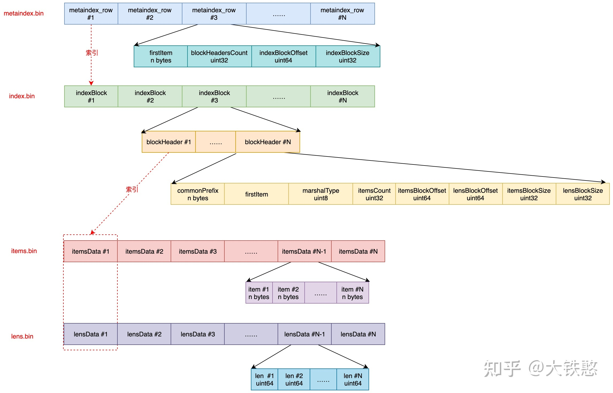
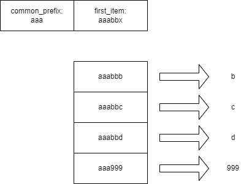
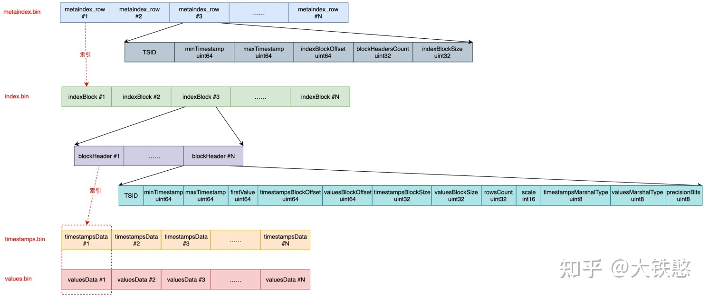
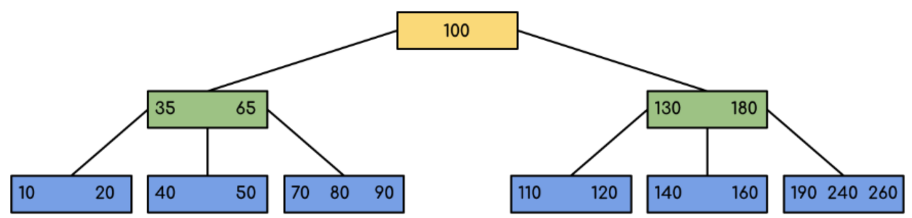

# 5.vm-storage基础结构

* 整个组件从逻辑上要分为索引部分和数据部分来分开看
  - 写入上是先索引再数据
  - 查询上也是先索引再数据
* 从程序运行的视角，可以分为内存对象结构部分和磁盘结构部分
  - 磁盘结构是目录结构和文件结构，是数据持久化后的静态的呈现
  - 内存对象结构是各种对象的关联及其层次结构，是运行期间协调的动态的呈现
  - 从层级上看，磁盘结构和内存结构几乎是一致的。

## 5.1 索引结构

一句话总结索引的结构如下：

* 整个索引可以看成一个排好序的巨大的 string 类型的数组
  * 把这个巨大的 string 数组分成如下的层级，分而治之：
    * 表：分为 prev 和 curr 两个表，分别存储两个 retention(存储时间期限) 的数据
    * part: 每个 part 会存储到一个独立的 part 文件夹
    * Block 组：包含多个 block
    * Block: 包含多个 item
    * Item: 这个巨大的 string 数组中的一条 string
*  每条索引字符串的第一个字节用 0-7 的一个数值来代表索引的类型：
  * 索引0：metricName -> tsid
  * 索引1：tag -> metric ID
  * 索引2：metric ID -> tsid
  * 索引3：metricID -> metricName
  * 索引4：deleted metric ID 1, deleted metric ID 2....
  * 索引5：date -> metric ID list (可以根据此索引知道：某一天有没有数据)
  * 索引6：date + tag -> metric ID list (可以根据此索引知道：某一天的某个 tag 有没有数据)
  * 索引7：date + metricName -> tsid list

* 每条索引的第二到第九字节，用于存储 tenant ID，这样就可以从逻辑上把不同的租户的数据隔离开

* 因为整个索引是个巨大的排好序的字符串数组，所以从索引中查询数据的方式就是前缀匹配的二分查找
  * 先查询 curr table，找不到再查询 prev table
  * 通过 part header 的 first item 来在多个 part 之间做二分查找，定位到数据所在的 part
  * 通过 block header 的 first item 来在多个 block 之间做二分查找，定位到数据所在的 block
  * 如果block数据不在内存，会把 block 加载到内存，形成一个 inMemoryPart
  * inMemoryPart 可以认为是一个完整的排好序的字符串数组，可以在 inMemoryPart 内通过前缀匹配 + 二分查找来找到记录

* 通过索引找到每条 metric 对应的 metric ID 后，再都数据区域去查询对应的 metrics 的 data point 数据。

* 因为数据都是前缀匹配，所以很多相同类型的索引前缀都是相同的。数据写入磁盘前，会提取公共的前缀，然后存储数据之间非公共的部分。

## 5.2 磁盘目录结构

这篇文章对目录结构有很好的介绍: [大铁憨(胡建洪):浅析下开源时序数据库VictoriaMetrics的存储机制](https://zhuanlan.zhihu.com/p/368912946)

* 可以通过vm-storage的命令行参数 `-storageDataPath`来指定存储文件的目录

* 数据根目录：
  * cache目录
    * 把fastcache中的key-value缓存数据，存储到文件中
    * 进程重启之后，从cache文件加载数据
    * 从而减少进程重启后带来的查询效率降低的影响
    * 每种cache类型一个子文件夹
  * data目录
    * 存储tsid, timestamp, value三种数据
  * indexdb目录
    * 存储metric数据
    * 存储各种索引的数据
  * snapshots目录
    * 备份的时候，通过硬链接(inode上加引用计数)把各个数据文件放在此目录下。备份完成后再删除。
  * flock.lock 文件锁对应的文件


### 5.2.1 indexdb目录

* indexdb包含每个索引分区的文件夹
  * 以 time.Now().UnixNano() 值为起点，递增后，转换为十六进制字符串，以此作为文件夹的名称
    * eg: 16C962219904346E
  * 以每个 `-retentionPeriod` 参数为周期进行切换，默认是31天
  * 只保留最近的两个分区，默认的retentionPeriod是31天的话，最多支持62天的metric查询。

* indexdb分区文件夹
  * 包含多个part文件夹
    * mem table和inmemoryPart的数据达到一定大小后，写入成为一个新的part
    * 小的part会不断合并为大的part
  * tmp文件夹
    * 写入part到磁盘的时候，先写到这个临时文件夹，完成后再mv到对应目录
    * merge过程中的文件也会先写到这个磁盘
  * txn文件夹
    * 小part合成大part后，需要删除多个小part。删除小part前先把文件名写入这个文件夹，防止突然断电丢失大量数据。
  * flock.lock文件锁对应的文件

* part目录：
  * 包含以下文件：
  * metadata.json: 整个part的概要信息
  * metaindex.bin: indexBlock的元信息
  * index.bin: 包含多个indexBlock信息
  * items.bin: 包含多个block
  * lens.bin: 包含每个block中每个item的长度信息

### 5.2.2 data目录

data目录包含big/small两个目录。这两个目录在这一级不太合理，其实是为了区分part的big和small。

big/small目录下面是partition目录。


* partition目录
  * 每个自然月一个partition目录，命名方式为`${YYYY}_${MM}`, eg: 2022_03
  * 完全超出`retentionPeriod`时间范围的partition会被删除
  * 每个partition目录下包含多个part目录
  * 包含tmp目录: 与indexdb的目录等同
  * 包含txn目录: 与indexdb的目录等同

* part目录
  * 目录的格式为: `${rowsCount}_${blocksCount}_${minTime}_${maxTime}_${partIndex}`
    * eg: 1741878_1741878_20220308032400.000_20220308032430.000_16D818AF14C88E1C
  * part目录包含以下文件：
    * metaindex.bin: indexRow的元数据信息
    * index.bin: 多个indexRow的信息
    * timestamps.bin: timestamp的数据
    * values.bin: value的数据


## 5.3 文件结构

文件都只在part目录下。

### 5.3.1 索引part

此处引用胡建洪画的图：



#### 5.3.1.1 metadata.json文件

metadata.json描述整个part的汇总信息，解析后对应这这个结构：

```go
// partHeader represents part header.
type partHeader struct {
	// RowsCount is the total number of rows in the part.
	RowsCount uint64

	// BlocksCount is the total number of blocks in the part.
	BlocksCount uint64

	// MinTimestamp is the minimum timestamp in the part.
	MinTimestamp int64

	// MaxTimestamp is the maximum timestamp in the part.
	MaxTimestamp int64

	// MinDedupInterval is minimal dedup interval in milliseconds across all the blocks in the part.
	MinDedupInterval int64
}
```

#### 5.3.1.2 metaindex.bin文件

metaindex.bin存储所有blockIndex的信息。

* 整个文件使用ZSTD压缩算法进行压缩
* 数据由连续的多个metaindexRow对象构成

```go
// metaindexRow describes a block of blockHeaders aka index block.
type metaindexRow struct {
	// First item in the first block.
	// It is used for fast lookup of the required index block.
	firstItem []byte  // 第一条索引的原始内容

	// The number of blockHeaders the block contains.
	blockHeadersCount uint32

	// The offset of the block in the index file.
	indexBlockOffset uint64   // index.bin 文件中的偏移量，同时还会作为fastcache中的key来使用

	// The size of the block in the index file.
	indexBlockSize uint32  // 块的字节数
}
```

* metaindexRow的信息可以通过index.bin文件加载为indexBlock对象
* metaindexRow之间通过firstItem字段进行排序


#### 5.3.1.3 index.bin文件

index.bin包含所有block的信息。

* index.bin一般通过内存映射文件的方式打开
* Index.bin中包含连续的多个indexBlock
* 每个indexBlock使用ZSTD算法压缩
* indexBlock包含blockHeader的数组
* blockHeader对象的内容为：

```go
type blockHeader struct {
	// common prefix for all the items in the block.
	commonPrefix []byte  // block内的所有索引的最大公共前缀

	// The first item.
	firstItem []byte  // 第一个索引的内容

	// Marshal type used for block compression.
	marshalType marshalType  //是否使用ZSTD压缩。很小的块是不压缩的

	// The number of items in the block, excluding the first item.
	itemsCount uint32  // 存在多少个索引

	// The offset of the items block.
	itemsBlockOffset uint64  // 在 items.bin 中的偏移量

	// The offset of the lens block.
	lensBlockOffset uint64  // 在 lens.bin 中的偏移量

	// The size of the items block.
	itemsBlockSize uint32  // 在 items.bin 中的长度

	// The size of the lens block.
	lensBlockSize uint32  // 在 lens.bin 中的长度
}
```

* 同样，多个blockHeader之间使用firstItem字段进行排序


#### 5.3.1.4 items.bin与lens.bin

* 通过blockHeader中lensBlockOffset和lensBlockSize两个字段，索引到lens.bin中的内容
  * 先做ZSTD解压缩
  * lens.bin中包含两种长度
    * 在items.bin中存储的数据的实际长度
    * 当前这条数据，相比前一条数据所拥有的公共前缀的长度
* 通过blockHeader中itemsBlockOffset和itemsBlockSize两个字段，索引到items.bin中的内容
  * 先做ZSTD解压缩
  * 根据lens.bin中的真实长度，读出每条item的数据
  * 根据与前一条数据的公共前缀长度，在前一条数据的基础上，拼接上公共前缀
  * 最后，根据blockHeader中的commonPrefix拼装出完整内容



如上图：数据存储上，先计算总体的公共前缀，在计算两两之间的公共前缀，以此来压缩存储空间。

细节请看我之前写的一篇分析文章：《[VictoriaMetrics源码阅读：极端吝啬，vm序列化数据到磁盘的细节](https://www.cnblogs.com/ahfuzhang/p/15932381.html)》


### 5.3.2 数据part

此处引用胡建洪画的图：



#### 5.3.2.1 metadata.bin文件

与indexdb类似，metadata.bin存储所有indexBlock的元数据信息。

* 整个文件使用ZSTD压缩
* 包含了连续的多条metaindexRow结构

​    See: [VictoriaMetrics-1.72.0-cluster/lib/mergeset/metaindex_row.go:13](https://github.com/ahfuzhang/victoria-metrics-1.72.0/blob/master/VictoriaMetrics-1.72.0-cluster/lib/mergeset/metaindex_row.go#L13)

* 每个metaindexRow对应着index.bin中的indexBlock

#### 5.3.2.2 index.bin

* 应用内存映射文件的方式来从index.bin获取数据
* 通过metaindexRow中的IndexBlockOffset+IndexBlockSize字段确定在index.bin文件中的位置
* 数据需要先进行ZSTD解压缩
* 之后是连续的多个blockHeader所表示的结构

​    内容比较长，请见：[VictoriaMetrics-1.72.0-cluster/lib/storage/block_header.go:17](https://github.com/ahfuzhang/victoria-metrics-1.72.0/blob/master/VictoriaMetrics-1.72.0-cluster/lib/storage/block_header.go#L17)

* indexBlock内的blockHeader数组会按照tsid进行排序

每个block只存储一个TSID的信息。

#### 5.3.2.3 timestamps.bin和values.bin

这两个文件存储tsid对应的时间戳和value。这两个文件都使用内存映射文件来读取数据。

* 通过blockHeader中的TimestampsBlockOffset+TimestampsBlockSize到timestamps.bin中读取数据
  * 根据blockHeader中的TimestampsMarshalType字段来决定如何进行ZSTD解压缩
    * 越大的块，压缩比越高
    * 很小的块，不压缩
* 通过blockHeader中的ValuesBlockOffset+ValuesBlockSize到values.bin中读取数据。
  * 根据blockHeader中的ValuesMarshalType字段来决定如何进行ZSTD解压缩
* 以上读到的数据通过`nearest delta`算法来还原为int64类型的值

数值压缩的算法介绍请看：[时间序列压缩算法解释(英文)](https://www.timescale.com/blog/time-series-compression-algorithms-explained/)


## 5.4 对象结构

### 5.4.1 索引

索引的对象层次可以表示如下：storage -> indexDB ->table-> partWrapper -> part -> indexBlock -> block -> item

|   对象   |  结构名    |   源码位置   |  备注    |
| :--: | :--: | :--- | :--- |
| 存储对象 | Storage | [VictoriaMetrics-1.72.0-cluster/lib/storage/storage.go:41](https://github.com/ahfuzhang/victoria-metrics-1.72.0/blob/master/VictoriaMetrics-1.72.0-cluster/lib/storage/storage.go#L41) | 全局的存储对象<br /> |
| 索引 | indexDB | [VictoriaMetrics-1.72.0-cluster/lib/storage/index_db.go:54](https://github.com/ahfuzhang/victoria-metrics-1.72.0/blob/master/VictoriaMetrics-1.72.0-cluster/lib/storage/index_db.go#L54) | 每个retentionPeriod切换一次。<br />默认是31天<br />包含curr和prev两个索引对象 |
| 表 | Table | [VictoriaMetrics-1.72.0-cluster/lib/mergeset/table.go:83](https://github.com/ahfuzhang/victoria-metrics-1.72.0/blob/master/VictoriaMetrics-1.72.0-cluster/lib/mergeset/table.go#L83) | 包含多个part |
| mem table | rawItemsShards | [VictoriaMetrics-1.72.0-cluster/lib/mergeset/table.go:128](https://github.com/ahfuzhang/victoria-metrics-1.72.0/blob/master/VictoriaMetrics-1.72.0-cluster/lib/mergeset/table.go#L128) | 数据先追加到内存表 |
| partWrapper | partWrapper | [VictoriaMetrics-1.72.0-cluster/lib/mergeset/table.go:216](https://github.com/ahfuzhang/victoria-metrics-1.72.0/blob/master/VictoriaMetrics-1.72.0-cluster/lib/mergeset/table.go#L216) | part分为文件part和inmemoryPart两种 |
| inmemoryPart | inmemoryPart | [VictoriaMetrics-1.72.0-cluster/lib/mergeset/inmemory_part.go:11](https://github.com/ahfuzhang/victoria-metrics-1.72.0/blob/master/VictoriaMetrics-1.72.0-cluster/lib/mergeset/inmemory_part.go#L11) | 内存中的part |
| part | part | [VictoriaMetrics-1.72.0-cluster/lib/mergeset/part.go:49](https://github.com/ahfuzhang/victoria-metrics-1.72.0/blob/master/VictoriaMetrics-1.72.0-cluster/lib/mergeset/part.go#L49) | 包含metaindexRow数组，可以进一步定位到indexBlock |
| indexBlock | indexBlock | [VictoriaMetrics-1.72.0-cluster/lib/mergeset/part.go:136](https://github.com/ahfuzhang/victoria-metrics-1.72.0/blob/master/VictoriaMetrics-1.72.0-cluster/lib/mergeset/part.go#L136) | part中不直接包含indexBlock，而是通过metaindexRow对象来获取 |
| Block | blockHeader | [VictoriaMetrics-1.72.0-cluster/lib/mergeset/block_header.go:12](https://github.com/ahfuzhang/victoria-metrics-1.72.0/blob/master/VictoriaMetrics-1.72.0-cluster/lib/mergeset/block_header.go#L12) | block的头信息<br />只是头，没有数据 |
|      | inmemoryBlock | [VictoriaMetrics-1.72.0-cluster/lib/mergeset/encoding.go:61](https://github.com/ahfuzhang/victoria-metrics-1.72.0/blob/master/VictoriaMetrics-1.72.0-cluster/lib/mergeset/encoding.go#L61) | 完全加载到内存中的block |

#### 5.4.1.1 table

table对象包含 `[]*partWrapper` 和 rawItemsShards。

* rawItemsShards相当于是用于数据追加的mem table
* []*partWrapper中包含了多个partWrapper，他们都是只读的
* table中的协程包括：
  * partMerger
    * 用于把part进行不断的merge
    * 协程数量为可用CPU核的数量
    * 最快1毫秒，最慢1秒，不断进行merge操作
  * rawItemsFlusher
    * 用于把mem table中的数据转换成inmemoryPart
    * 一个协程
    * 每秒执行一次
  * flushCallback协程
    * 执行调用者要求的回调任务(一般用于控制cache版本)
    * 1个协程
    * 10秒执行一次

#### 5.4.1.2 part

part也可以使用B树的结构来描述：



* part对象的结构为：

see: [VictoriaMetrics-1.72.0-cluster/lib/storage/part.go:34](https://github.com/ahfuzhang/victoria-metrics-1.72.0/blob/master/VictoriaMetrics-1.72.0-cluster/lib/storage/part.go#L34)

```go
type part struct {  // 所有的索引是排序后存储的，每个part对象管理一部分索引
	ph partHeader  // 头部信息

	path string

	size uint64

	mrs []metaindexRow  //这个数组的内容来自对 metaindex.bin文件的解析
		// 数组按照 firstItem 来排序，便于做二分查找
	indexFile fs.MustReadAtCloser  // 三个内存映射文件  index.bin
	itemsFile fs.MustReadAtCloser  //  items.bin
	lensFile  fs.MustReadAtCloser  // lens.bin

	idxbCache *indexBlockCache  // 从 index.bin中加载的数据，放在cache里面  //两级缓存。这一级缓存indexBlock
	ibCache   *inmemoryBlockCache  // 以偏移量为key  //  这一级缓存 block
}
```

对于文件part，指定part目录后，会加载metadata.json, metaindex.json两个文件。

* partHeader对象记录了整个part的概要信息
  * 通过firstItem和lastItem两个字段，可以确定所有数据的起止范围
  * see: [VictoriaMetrics-1.72.0-cluster/lib/mergeset/part_header.go:15](https://github.com/ahfuzhang/victoria-metrics-1.72.0/blob/master/VictoriaMetrics-1.72.0-cluster/lib/mergeset/part_header.go#L15)
* []metaindexRow数组记录了part下的所有indexBlock的信息
  * []metaindexRow 会按照 firstItem 来排序。
  * see: [VictoriaMetrics-1.72.0-cluster/lib/storage/metaindex_row.go:15](https://github.com/ahfuzhang/victoria-metrics-1.72.0/blob/master/VictoriaMetrics-1.72.0-cluster/lib/storage/metaindex_row.go#L15)

* 三个重要的数据文件以内存映射文件的方式打开：
  * index.bin: 记录一个indexBlock里面有哪些block
  * items.bin: 以block为单位顺序存储，每个block里面有多个索引
  * lens.bin: 记录items.bin中的起止位置
* 两级缓存：
  * indexBlockCache： 以index.bin中的偏移量为key，缓存对应的block的信息
  * inmemoryBlockCache: 以items.bin中的偏移量为key，记录block的完整信息。
    * inmemoryBlockCache指向inmemoryBlock对象
    * inmemoryBlock在内存中已经是完全可读了(存储格式转换为内存格式)

#### 5.4.1.3 indexBlock

see: [VictoriaMetrics-1.72.0-cluster/lib/storage/part.go:140](https://github.com/ahfuzhang/victoria-metrics-1.72.0/blob/master/VictoriaMetrics-1.72.0-cluster/lib/storage/part.go#L140)

```go
type indexBlock struct {  // 内容来自 index.bin 文件
	bhs []blockHeader  // 按照 first item排序的数组，可用于二分查找
}
```

indexBlock包含多个block。

indexBlock中的blockHeader信息是从index.bin中读取得到的。

#### 5.4.1.4 block

一个block即一个 sstable。

see: [VictoriaMetrics-1.72.0-cluster/lib/storage/block_header.go:17](https://github.com/ahfuzhang/victoria-metrics-1.72.0/blob/master/VictoriaMetrics-1.72.0-cluster/lib/storage/block_header.go#L17)

* 什么情况下会触发block的加载？
  * 写入新的time series数据的时候inmemoryBlock(Add方法)，然后转换成只读的inmemoryPart
  * 通过Unmarshal方法填充
    * merge的时候填充
    * partSearch中，查询的时候填充


### 5.4.2 数据

数据的对象层次可以表示如下：storage -> table-> partitionWrapper -> partition -> part -> partWrapper -> indexBlock -> block -> timestamp&value
|   对象   |  结构名    |   源码位置   |  备注    |
| :--: | :--: | :--- | :--- |
| 存储对象 | Storage | [VictoriaMetrics-1.72.0-cluster/lib/storage/storage.go:41](https://github.com/ahfuzhang/victoria-metrics-1.72.0/blob/master/VictoriaMetrics-1.72.0-cluster/lib/storage/storage.go#L41) | 全局的存储对象<br /> |
| 表 | Table | [VictoriaMetrics-1.72.0-cluster/lib/storage/table.go:19](https://github.com/ahfuzhang/victoria-metrics-1.72.0/blob/master/VictoriaMetrics-1.72.0-cluster/lib/storage/table.go#L19) | 包含多个partitionWrapper |
| Partition的包装 | partitionWrapper | [VictoriaMetrics-1.72.0-cluster/lib/storage/table.go:39](https://github.com/ahfuzhang/victoria-metrics-1.72.0/blob/master/VictoriaMetrics-1.72.0-cluster/lib/storage/table.go#L39) | 包含一个partition对象 |
| 分区 | partition | [VictoriaMetrics-1.72.0-cluster/lib/storage/partition.go:109](https://github.com/ahfuzhang/victoria-metrics-1.72.0/blob/master/VictoriaMetrics-1.72.0-cluster/lib/storage/partition.go#L109) | 包含smallParts和bigParts的数组<br />包含内存表rawRowsShards |
| 内存表 | rawRowsShards | [VictoriaMetrics-1.72.0-cluster/lib/storage/partition.go:442](https://github.com/ahfuzhang/victoria-metrics-1.72.0/blob/master/VictoriaMetrics-1.72.0-cluster/lib/storage/partition.go#L442) | 数据会先写入到内存表中 |
| part的包装 | partWrapper | [VictoriaMetrics-1.72.0-cluster/lib/storage/partition.go:172](https://github.com/ahfuzhang/victoria-metrics-1.72.0/blob/master/VictoriaMetrics-1.72.0-cluster/lib/storage/partition.go#L172) | 包含了part和inmemoryPart。<br />part分为文件part和内存part |
| part | part | [VictoriaMetrics-1.72.0-cluster/lib/storage/part.go:34](https://github.com/ahfuzhang/victoria-metrics-1.72.0/blob/master/VictoriaMetrics-1.72.0-cluster/lib/storage/part.go#L34) | 包含metaindexRow数组，可以进一步定位到indexBlock |
| inmemoryPart | inmemoryPart | [VictoriaMetrics-1.72.0-cluster/lib/storage/inmemory_part.go:23](https://github.com/ahfuzhang/victoria-metrics-1.72.0/blob/master/VictoriaMetrics-1.72.0-cluster/lib/storage/inmemory_part.go#L23) | rawRowsShards的内存表的数据，会转换为inmemoryPart |
| indexBlock | indexBlock | [VictoriaMetrics-1.72.0-cluster/lib/storage/part.go:140](https://github.com/ahfuzhang/victoria-metrics-1.72.0/blob/master/VictoriaMetrics-1.72.0-cluster/lib/storage/part.go#L140) | part中不直接包含indexBlock，而是通过metaindexRow对象来获取 |
| Block | blockHeader | [VictoriaMetrics-1.72.0-cluster/lib/storage/block_header.go:17](https://github.com/ahfuzhang/victoria-metrics-1.72.0/blob/master/VictoriaMetrics-1.72.0-cluster/lib/storage/block_header.go#L17) | block的头信息<br />只是头，没有数据 |

#### 5.4.2.1 table对象

table对象是数据存储部分的顶层对象。

* table对象包含的协程有：
  * RetentionWatcher
    * 1个协程
    * 每分钟执行一次
    * 用于把超时所管理时间范围的part进行丢弃
  * FinalDedupWatcher
    * 1个协程
    * 每小时执行一次
    * 在所有partition上执行forceMerge

#### 5.4.2.2 partition对象

* partition对象包含的协程有：
  * MergeWorkers
    * 开始CPU核数二分之一的协程，用于smallPart的合并
    * 开始CPU核数二分之一的协程，用于bigPart的合并
    * 合并的间隔时间，最少10毫秒，最多10秒
  * RawRowsFlusher
    * 一个协程
    * 1秒执行一次
    * 用于把mem table中的数据转移到inmemoryPart
  * InmemoryPartsFlusher
    * 一个协程
    * 5秒执行一次
    * 用于合并smallPart中的inmemoryPart
  * StalePartsRemover
    * 一个协程
    * 7分钟执行一次
    * 删除超过管理时间的part

### 5.4.3 storage对象

storage对象封装索引和数据两部分的顶层对象。

* 包含curr和prev两个indexDB对象，默认支持最多62天的索引查询
* 包含一个数据存储的table对象
* storage对象上的协程：
  * CurrHourMetricIDsUpdater
    * 每 10 秒，把这一小时的 metricID 写入uint64set
  * NextDayMetricIDsUpdater
    * 每 11 秒，把这一天的新产生的metricID写入uint64set结构
  * RetentionWatcher
    * 每31天+4小时切换一个indexdb
  * FreeDiskSpaceWatcher
    * 每30秒，检查剩余磁盘空间


## 5.5 cache

### 5.5.1 索引cache

#### 5.5.1.1 part对象上的cache

* indexBlockCache
  * 以index.bin中偏移量为key
  * value为indexBlock对象
  * 会专门开启一个协程来清理过期数据
    * 每30秒一次，清理掉120秒未访问的项
    * 每120秒一次，清理掉cache miss的统计数据

  * 任何一个key，必须cache miss至少两次才会写入缓存
    * 避免非常临时的数据占用缓存空间

* inmemoryBlockCache
  * 以items.bin中的偏移量为key
  * value为inmemoryBlock对象，即全部加载到内存的block
  * 会专门开启一个协程来清理过期数据
    * 每30秒一次，清理掉120秒未访问的项
    * 每120秒一次，清理掉cache miss的统计数据

  * 任何一个key，必须cache miss至少两次才会写入缓存


#### 5.5.1.2 table对象上的mem table: rawItemsShards

索引会先写入mem table，也算是某种写缓存。

See: [VictoriaMetrics-1.72.0-cluster/lib/mergeset/table.go:128](https://github.com/ahfuzhang/victoria-metrics-1.72.0/blob/master/VictoriaMetrics-1.72.0-cluster/lib/mergeset/table.go#L128)

* rawItemsShards使用与可用CPU核数相同的分桶
* 每次写入数据前，先对shardIdx字段原子加，然后取模桶长度来确定分桶
  * 理论上每次写入都会跳转到不同的分桶，减少锁竞争
* rawItemsShards对象再包含多个rawItemsShard对象
  * rawItemsShard对象再包含多个inmemoryBlock对象
  * 每个inmemoryBlock最多写入64KB数据，写满后再申请一个inmemoryBlock
  * 最多允许512个inmemoryBlock对象，超过这个数量就执行merge流程
    * 也就是说，每个rawItemsShard最多缓存32mb数据
    * 假设vm-storage配置为16核，mem table的最大容量为32*16=512mb

* table对象会创建一个清理mem table的协程
  * 每秒执行一次
  * 当一个rawItemsShard积累的数据大于等于2秒，进入合并流程

#### 5.5.1.3 indexDB上的cache

这里的cache使用workingsetcache.Cache对象来缓存key-value格式数据。

See: [VictoriaMetrics-1.72.0-cluster/lib/workingsetcache/cache.go:25](https://github.com/ahfuzhang/victoria-metrics-1.72.0/blob/master/VictoriaMetrics-1.72.0-cluster/lib/workingsetcache/cache.go#L25)

workingsetcache.Cache又使用了fastcache组件来缓存数据。

关于fastcache组件的细节，请看：《[介绍一个golang库：fastcache](https://www.cnblogs.com/ahfuzhang/p/15840313.html)》


* tagFiltersCache成员
  * TagFilters -> TSIDs 的缓存
  * 相当于把上次搜索表达式所涉及的metric的tsid缓存下来，如果下次还是同样的表达式就不用再搜索TSID了
* loopsPerDateTagFilterCache成员
  * 索引分为日期索引和全局索引。这里的日期索引来加速某一个日期的搜索的场景。搜索不到再退回到全局索引去搜索
  * (date, tagFilter) -> loopsCount
  * Key: indexDB名称 + 日期 + tagFilter过滤表达式 + accountID + projectID
  * Value: loopsCount + filterLoopsCount + currentTimestamp


### 5.5.2 数据cache

#### 5.5.2.1 part对象上的cache

* indexBlockCache
  * See: [VictoriaMetrics-1.72.0-cluster/lib/storage/part.go:148](https://github.com/ahfuzhang/victoria-metrics-1.72.0/blob/master/VictoriaMetrics-1.72.0-cluster/lib/storage/part.go#L148)
  * 以index.bin中偏移量为key
  * value为indexBlock对象
  * 会专门开启一个协程来清理过期数据
    * 每30秒一次，清理掉120秒未访问的项


#### 5.5.2.2 partition对象上的mem table: rawRowsShards对象

数据会先写入mem table。

* rawRowsShards使用与可用CPU核数八分之一的分桶
  * eg: vm-storage配置16核的话，有两个分桶
* 每次写入数据前，先对shardIdx字段原子加，然后取模桶长度来确定分桶
  * 通过分桶来减少锁竞争
* rawRowsShards对象再包含多个rawRowsShard对象
  * rawRowsShard对象包含rawRow结构的数组
    * rowRow是要写入的数据的格式，一般是tsid, timestamp, value等字段
  * rawRow数组的大小根据用户配置的最大可用内存来决定
    * 最少1万条
    * 最多50万条
    * 配置16核的情况下，可用内存超过13.3GB时，rawRow数组就是50万
  * 添加的数据会直接追加到rawRow数组中
  * rawRow数组写满后，执行flush操作，然后清空rawRow数组
* partition对象会创建一个清理mem table的协程
  * 每秒执行一次
  * 当一个rawRowsShard积累的数据大于等于2秒，进入合并流程

#### 5.5.2.3 没有block cache

通常，TSDB中最常见的查询是获取每个metric最新的数据，因此缓存某个时间段内的数据收益不大。


### 5.5.3 全局cache

即在Storage对象上的缓存对象。

* workingsetcache.Cache类型的cache
  * tsidCache: Metric -> TSID
    * 插入新的metric的时候，触发这个cache的更新
  * metricIDCache: MetricID -> TSID
    * 查询数据的时候，触发更新此cache
  * metricNameCache: MetricID -> Metric
    * 查询数据的时候，触发更新此cache
* fast cache类型的cache
  * currHourMetricIDs: 记录当前这一小时存在的metricID
  * prevHourMetricIDs: 记录前一小时存在的metricID
  * nextDayMetricIDs: 记录最近一天的metricID
  * deletedMetricIDs: 用户调用删除接口所删除的metricID
* dateMetricIDCache
  * 记录某天的所有存在的metricID
