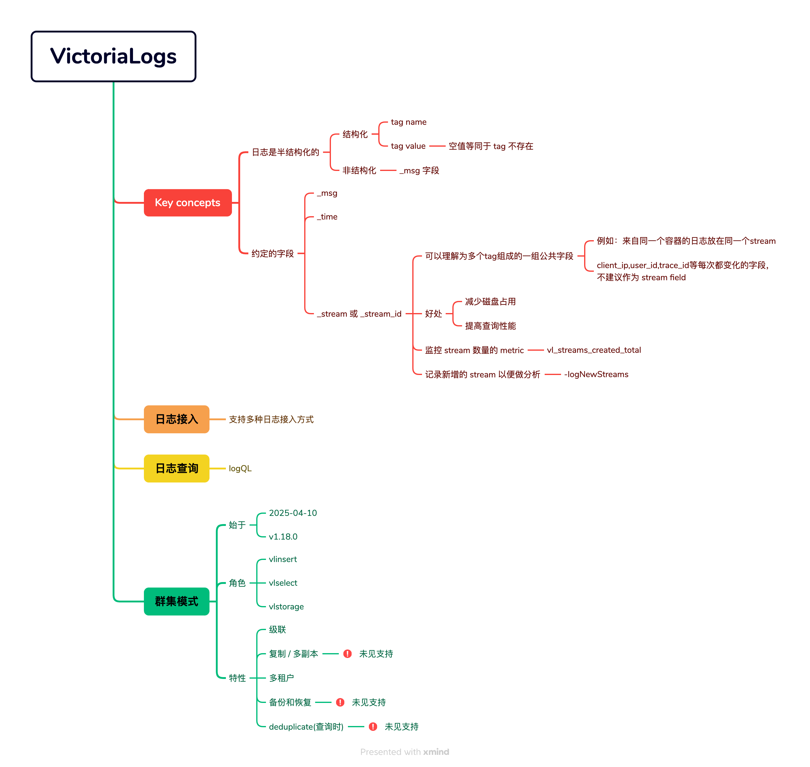

# [WIP]8.VictoriaLogs 基础知识

2023 年 6 月，VM 团队开了一个新的产品线： VictoriaLogs.
两年过去了，VictoriaLogs 已经非常成熟，并且还推出了群集版本。
这个产品一如既往了延续了高性能低成本的风格，深入研究源码后，也看到了很多精彩的设计。

## 8.1 核心概念

### 8.1.1 日志的结构
目前的日志都是半结构化的，通常如下:

```text
timestamp: 2025-05-30 14:23:49.123
tag_name_1: tag_value_1
tag_name_2: tag_value_2
tag_name_3: tag_value_3
message: very long text
```

或以 JSON 格式表示：

```json
{
  "timestamp": "2025-07-01T10:35:27.123Z",
  "tags": {
    "level": "INFO",
    "service": "auth-service",
    "region": "ap-southeast-1",
    "instance": "node-7"
  },
  "message": "User login succeeded for user_id=9482, method=oauth2"
}
```


日志由三部分构成：

- 时间戳 (timestamps)
- 标签 (tags)
- 消息 (message)

显而易见，在标签部分，tag name + tag value 的格式， 与 metrics 数据的格式是一致的。
因此，如果用存储 metrics 数据的方式来存储标签部分，那么就可以利用 tsdb 的存储引擎来高效过滤日志。


* 从用户行为看：日志数据写极多，读极少。因此探寻日志数据的规律，通过消耗更多的 cpu 资源来把日志数据做到尽可能高的压缩率，并且根据查询的需求把数据组织起来是很重要的。


### 8.1.2 数据的组织方式

* 以日志的时间戳来对日志数据分片
  * 每天一个文件夹
    * 由此：存储更长时间的日志，只会影响磁盘空间，不会影响写入性能、查询性能、索引大小等。
  * 数据的保存周期最少 1 天
  * 超过数据保存天数的旧文件夹会自动删除
    * 从而避免存储空间变满
* 通过索引和数据两部分来存储日志
  * 日志中的tag name 和 tag value 存储为索引
    * 查询时可以通过过滤 tag 来缩小日志的搜索范围
    * 更准确地说：只有设定为 stream field 的 tag 才会放入索引
  * 完整的一行日志(时间戳，tags, message)会完整的存储到数据部分


### 8.1.3 streamID 的概念

变化不频繁的 tag 可以作为 stream 的区分字段。
例如：`idc + 机器ip + 容器 + 服务 + 日志输出位置` 构成一个 stream
从而，同一个输出位置的日志会被放在内部的一个 stream 中。

注意：频繁变化的字段，一定不要放在 stream 中。例如 client ip, user id 等。

所有的 stream tag 放在一个 buffer 中，然后使用 xxhash 库计算 128 bit 的 hash 值。此 hash 值就是 streamID。

选择哪些 tag 作为日志的 stream，可以参考以下原则：

* stream 的核心用途是把一部分日志行放在同一个块中存放
  * 因此，stream tag 太少，会导致存储时的快太大，无法高效地过滤不需要的数据
  * Stream tag 太多，会导致块太多，从而数据的压缩率不高，且搜索时需要关联很多的块，同样影响性能

* Stream 同样会影响日志的写入逻辑：
  * 假如 tag1 + tag2 + tag3 的日志中，我们把 tag1 + tag2 作为 stream，第一次产生这样的日志时，tag1/tag2/tag3 都会建立索引。
  * 如果后续日志中又出现了新的 tag，例如：tag1 + tag2 + tag3 + tag4这样的组合，因为 tag1 + tag2 不变，就会认为这条日志是已经存在的 stream，因此 tag4 不会被写入索引中。未来如果通过 tag4 过滤，是无法通过索引来加速的，只能到数据部分进行过滤。
  * 因此，tag 的数量如果在日志输出的过程中动态增减，需要考虑到对索引的印象。
  * 一定只有 stream field 中的 tag 才会建立索引
* 不要把频繁变化的 tag value 放到 stream 中：
  * 例如：user id, client ip 等（除非大多数情况下都要根据这个字段来过滤）
  * 如同 VictoriaMetrics，过多的 time series 会导致创建大量索引。过多的不同 tag 的组合也会导致创建大量索引。


### 8.1.4 使用 sstable 来存储索引

VictoriaLogs 的索引，完全复用了 VictoriaMetrics 的索引的代码，他们都是通过 sstable 来组织起来索引数据：

* sstable(Sorted String Table) 可以理解为非常非常多排好序的字符串
* key-value结构会序列化成字符串，然后放到 sstable 中
* 通过二分查找 + 前缀匹配，即可搜索到需要的 key-value


### 8.1.5 使用 block 来存储日志数据

同一个 streamID 的日志，会存储在一个 block 中。block 中包含了多行日志的 timestamp, tags 和 message。

有这样一些机制来对block中的日志进行压缩：

* 所有的 timestamp 单独存放
  * 如果所有的timestamp都相同，则只存储一个值
  * timestamp会进行排序，从小到大，然后后一项与前一项相减，得到 delta 值，然后存储第一个 timestamp 和 delta 值
    * 一个完整的 timestamp 需要一个 int64 来保存，但是如果一个 block 中的日志差不多都是在邻近的时间段产生的，这样相减后的 delta 值就比较小，可能用更少的 bits 就能存储下来，节省存储空间
* 日志中的 message 部分，被看做 tag name 为 _msg 的 tag，其处理行为与 tag 一致
* 如果一个 tag 的所有 tag value 都一样，则这个 tag 被成为 const column，存储时只存储一个 tag name 和 tag value
* 每个 tag name 会转换为 column，每个 tag name 只存储一次
* 所有的 tag value 会做很多种格式判断：
  * 如果所有的 tag value都只有很少的几种组合，则按照字典格式存储：在 block header 中存储字典的值，然后 tag value中存储字典中的下标
  * 如果所有的 tag value 都是 uint64 / int64 / float64，则转换为数值类型来存储
  * 如果所有的 tag value 都是 ipv4，则转换成数值类型来存储
  * 如果是无规律的字符串，则按照字符串来存储

* 每个 column 内的 tag value，会进行分词处理

  * 对于 ASCII 字符集，连续的 0-9, a-z, A-Z 和 _ 被认为是一个 token
  * 对于 unicode 字符集，会先把 utf-8 解码为逐个 rune 字符，然后判断是否是 token
    * 注意：<font color=red>连续的unicode串会被认为是一个token，所以如果日志中有中文，整个中文长句子会被认为是一个词</font> 

  * 分词得到 token 后，通过 xxhash 计算得到一个 hash 值，然后把 hash 值保存到 bloom filter 数据结构中
  * 存储到磁盘时，会写一个独立的 bloom filter 的文件

* 所有的数据写入磁盘时，会使用 ZSTD 压缩算法进行压缩

### 8.1.6 数据的层级结构

索引数据通过如下的层级组织起来：

* partition: 每天一个分区文件夹

* Indexdb: 仅一个文件夹，内部是索引相关的数据文件

* Part:  用一个独立文件夹存储多个索引文件

* Block:  每个数据文件中包含多个 block

* IndexItem: 具体的一条索引，由索引类型 + tenantID + key + value 构成

* inMemoryPart: 内存中的 part 数据，积累到一定的量后，存储到磁盘，成为独立的 part 文件夹

* Rows 数组：索引创建时被追加到一个大数组，积累到一定的量后，变成 inMemoryPart

  

日志数据通过如下的层级组织起来：

* Partition: 每天一个分区文件夹
* datadb: 仅一个文件夹，内部是日志数据相关的文件
* Part: 用一个独立的文件夹存储多个数据文件
* Block: 一个 part 中的数据文件，包含多个 block；每个 block 存储一个 streamID 的多条日志
* LogItem: block 中一条日志的内容，包含 timestamp 和 tags (message 是一个叫做 _msg 的 tag)


对一些基本概念总结如下：


* tag value 为空时，相当于不存在这个 tag，不会写入对应的数据。
* tag name 最多 128 字节，超过这个长度会被截断
* message 字段的 tag name 是 _msg
  - 写入索引时，message 对应的 tag name 是空字符串
* tenantID 概念：用户可以使用两个 uint32 来表示一个 tenantID
  - 区分 tenantID 后，每次查询必须提供正确的 tenantID
  - 在索引部分，tenantID 是所有数据的前缀。因此猜不到别的业务的 tenantID 就会查询不出数据，从而实现了租户的数据隔离。


## 8.2 数据的目录结构
VictoriaLogs 存储数据的目录结构如下：

- partitions
  - 20060102 (日志数据的切换周期为天)
    - indexdb (索引文件夹)
        - parts.json
        - part 文件夹(uuid 命名的 part 文件夹)
            - metaindex.bin
            - index.bin
            - items.bin
            - lens.bin
    - datadb  (数据文件夹)
        - parts.json
        - part 目录  (运行的时候会区分是大part还是小part,  smallPart / bigPart )
            - column_names.bin
            - metaindex.bin
            - index.bin
            - columns_header_index.bin
            - columns_header.bin
            - timestamps.bin
            - message_bloom.bin  (part 下面又有 block 的概念，一个 block 只存储同一个 streamID 的日志数据)
            - message_values.bin

有这样一些特性：
* VictoriaLogs 启动时，超过保存天数的文件夹会被删除
* 每天会建立一个新的文件夹，文件夹中包含索引和数据
* 进程启动时还会创建锁文件：flock.lock


## 8.3 索引的格式
日志中的所有 tag 都会建立索引

```go
// lib/logstorage/indexdb.go:20
const (
	// (tenantID:streamID) entries have this prefix
	//
	// These entries are used for detecting whether the given stream is already registered
	nsPrefixStreamID = 0

	// (tenantID:streamID -> streamTagsCanonical) entries have this prefix
	nsPrefixStreamIDToStreamTags = 1

	// (tenantID:name:value => streamIDs) entries have this prefix
	nsPrefixTagToStreamIDs = 2
)
```

根据源码可知：
* 0 是 streamID 的索引
* 1 是 streamID 到 stream tag 的索引
* 2 是 tag name + tag value -> streamID 的索引

日志中所有的 tag 都会建立索引，最多允许 1000 个 tag.

```go
	// Register tenantID:name:value -> streamIDs entries.
	tags := st.tags
	for i := range tags {
		bufLen = len(buf)
		buf = marshalCommonPrefix(buf, nsPrefixTagToStreamIDs, tenantID)
		buf = tags[i].indexdbMarshal(buf)
		buf = streamID.id.marshal(buf)
		items = append(items, buf[bufLen:])
	}
```


<font color=red>查询时：只有选择 stream field 中的字段，才会命中索引</font>


## 8.4 数据的格式

### 8.4.1 block header
一个 column 序列化时，会判断列属于什么数据类型。
列的数据类型如下：

```go
// lib/logstorage/values_encoder.go
// valueType is the type of values stored in every column block.
type valueType byte

const (
	// valueTypeUnknown is used for determining whether the value type is unknown.
	valueTypeUnknown = valueType(0)

	// default encoding for column blocks. Strings are stored as is.
	valueTypeString = valueType(1)

	// column blocks with small number of unique values are encoded as dict.
	valueTypeDict = valueType(2)

	// uint values up to 2^8-1 are encoded into valueTypeUint8.
	// Every value occupies a single byte.
	valueTypeUint8 = valueType(3)

	// uint values up to 2^16-1 are encoded into valueTypeUint16.
	// Every value occupies 2 bytes.
	valueTypeUint16 = valueType(4)

	// uint values up to 2^31-1 are encoded into valueTypeUint32.
	// Every value occupies 4 bytes.
	valueTypeUint32 = valueType(5)

	// uint values up to 2^64-1 are encoded into valueTypeUint64.
	// Every value occupies 8 bytes.
	valueTypeUint64 = valueType(6)

	// int values in the range [-(2^63) ... 2^63-1] are encoded into valueTypeInt64.
	valueTypeInt64 = valueType(10)

	// floating-point values are encoded into valueTypeFloat64.
	valueTypeFloat64 = valueType(7)

	// column blocks with ipv4 addresses are encoded as 4-byte strings.
	valueTypeIPv4 = valueType(8)

	// column blocks with ISO8601 timestamps are encoded into valueTypeTimestampISO8601.
	// These timestamps are commonly used by Logstash.
	valueTypeTimestampISO8601 = valueType(9)
)
```


**从这里可以看出：VictoriaLogs 花费大量的算力在对数据进行编码，从而节省存储空间。**


为了达到高压缩率，对数据的探测其实是比较耗资源的：

```go
// lib/logstorage/values_encoder.go
func (ve *valuesEncoder) encode(values []string, dict *valuesDict) (valueType, uint64, uint64) {
	ve.reset()

	if len(values) == 0 {
		return valueTypeString, 0, 0
	}

	var vt valueType
	var minValue, maxValue uint64

	// Try dict encoding at first, since it gives the highest speedup during querying.
	// It also usually gives the best compression, since every value is encoded as a single byte.
	ve.buf, ve.values, vt = tryDictEncoding(ve.buf[:0], ve.values[:0], values, dict)
	if vt != valueTypeUnknown {
		return vt, 0, 0
	}
	// todo: 值得使用 simd 来优化整数转换
	ve.buf, ve.values, vt, minValue, maxValue = tryUintEncoding(ve.buf[:0], ve.values[:0], values)
	if vt != valueTypeUnknown {
		return vt, minValue, maxValue
	}

	ve.buf, ve.values, vt, minValue, maxValue = tryIntEncoding(ve.buf[:0], ve.values[:0], values)
	if vt != valueTypeUnknown {
		return vt, minValue, maxValue
	}

	ve.buf, ve.values, vt, minValue, maxValue = tryFloat64Encoding(ve.buf[:0], ve.values[:0], values)
	if vt != valueTypeUnknown {
		return vt, minValue, maxValue
	}

	ve.buf, ve.values, vt, minValue, maxValue = tryIPv4Encoding(ve.buf[:0], ve.values[:0], values)
	if vt != valueTypeUnknown {
		return vt, minValue, maxValue
	}

	ve.buf, ve.values, vt, minValue, maxValue = tryTimestampISO8601Encoding(ve.buf[:0], ve.values[:0], values)
	if vt != valueTypeUnknown {
		return vt, minValue, maxValue
	}

	// Fall back to default encoding, e.g. leave values as is.
	ve.values = append(ve.values[:0], values...)
	return valueTypeString, 0, 0
}
```


## 8.5 cache 结构

* cache 有两个分片：prev 和 curr
* 每隔 3 分钟左右：prev 会被丢弃，curr 变成 prev，然后一个新的 sync.Map 对象作为 curr
  * 因此，cache 只能存储最多 6 分钟左右的数据
  * 为什么缓存切换不是精确的 3 分钟？猜测这里是为了避免在分布式环境中，所有的存储节点的缓存一起失效引起抖动。
  * 为何 cache 的时间如此之短？以 filterStreamCache 为例，每次查询时，通过查询表达式来得到上次搜索所有相关的 streamID。相当于 6 分钟之内，新产生的 streamID 是搜索不到的。
    * 不缓存，频繁的查询就会每次都搜索索引
    * 缓存了，缓存周期内的产生的数据查询不到
    * 最终，6 分钟左右的时间可能在查询性能和新 streamID 可搜索到这两个事情上，可以取一个平衡
* 两个 cache 对象都是 storage 对象的成员
* cache 处于 storage 对象上，与 partition 无关

### 8.5.1 streamID cache

* key: 分区名 + streamID
* value: bool 值，表示某一天存在此 streamID

### 8.5.2 filterStreamCache

相当于把查询表达式为 key，对应着与这个 key 相关的所有 streamID

> logsSQL expr -> streamID list


## 8.6 日志数据写入流程

* Vlinsert 服务
* Vlstorage 服务
* internal/insert 接口
* 各种日志数据的解析模块：jsonline 等
* 写入 Rows
* Rows 变成 inMemoryPart
* inMemoryPart 积累多个后，把数据 flush 到磁盘
* 计算每条日志的 streamID
* 从 cache 搜索 streamID 是否已经存在
  * 不存在，创建新的 streamID
    * 创建索引 0：streamID -> 空，表示存在这样一个 streamID
    * 创建索引 1:   streamID -> stream tags
    * 创建索引 2: 为每个 tag 创建索引， tag name + tag value -> streamID
  * 存在，跳过写索引的步骤
* 写入数据
  * 计算 const 列
  * 每一列的 values，尝试解析数据类型，根据数据类型做转换
  * 每一列的values 中的每个 value，做分词运算，然后把分词结果计算 hashcode，然后写入 bloom filter
  * 数据做 zstd 压缩，写入文件


### elasticsearch 格式写入

app/vlinsert/elasticsearch/elasticsearch.go

http body:

```json
{"create":{"_index":"filebeat-8.8.0"}}
{"@timestamp":"2023-06-06T04:48:11.735Z","log":{"offset":71770,"file":{"path":"/var/log/auth.log"}},"message":"foobar"}
{"create":{"_index":"filebeat-8.8.0"}}
{"@timestamp":"2023-06-06 04:48:12.735+01:00","message":"baz"}
{"index":{"_index":"filebeat-8.8.0"}}
{"message":"xyz","@timestamp":"1686026893735","x":"y"}
{"create":{"_index":"filebeat-8.8.0"}}
{"message":"qwe rty","@timestamp":"1686026893"}
{"create":{"_index":"filebeat-8.8.0"}}
{"message":"qwe rty float","@timestamp":"1686026123.62"}
```

http querystring:

* AccountID
* ProjectID
* _time_field
* _msg_field
* _stream_fields
* ignore_fields
* decolorize_fields
* extra_fields
* debug

请求路径：/insert/elasticsearch/_bulk


## 8.7 数据查询流程

* vlselect 转发到 vlstorage
* Vlstorage 中根据路径跳转到处理函数
* 解析查询表达式，生成 Query 对象
* 根据查询的时间范围，每天的数据创建一个协程，进行搜索
  * 如果允许用 N 个 CPU 核，则全局只允许 N 个协程，在每天的 partition 上搜索
* 每个查询，创建 N 个核对应的 N 个消费者协程，用于搜索到 block 后，对 block 的数据进行解析
  * 如果只查一天内的数据，则只有 1 个搜索协程
  * 每次查询都会有 N 个消费协程
* 使用查询缓存： logsQL -> streamID list，缓存 6 分钟内的查询结果
  * 缓存有数据：使用 streamID 的列表，在数据部分进行搜索
  * 缓存无数据：
    * 根据 tag name + tag value， 构造索引 2 的前缀
    * 使用火山模型，依次逐层搜索符合条件的索引
      * 先在一天内的所有 part header 上做二分查找
      * 在每个 part 的所有 block header 上做二分查找
      * Block 不在内存中，就把 block 载入内存，形成 sstable
      * 在 sstable 上做二分查找
    * 最终在索引上得到所有符合条件的 streamID

* 得到 streamID list 后，在数据上搜索
  * 使用火山模型，逐层搜索符合条件的 block
    * 先搜索一天内的所有 part header
    * 在 part 内搜索 block header
  * 每个 block 与 streamID 是对应的
  * 把 block 的信息写入 channel，等待消费者协程来处理
* 消费者协程：
  * 得到 block 的信息后，把 block 载入内存
  * 执行各种 filter
* 数据回传
  * 把数据写入 writeBlock 的回调函数
  * 函数中对数据做序列化，发送给请求端


## 8.8 群集版

群集版没有区分不同角色的进程，仍然只是一个独立的 victoria-logs 进程。

这个进程里同时启动了 vlselect, vlinsert 和 vlstorage 三种角色。（不合理，未来的版本可能会修改过来）


### vlinsert

* 可以启动 tcp 或者 udp 的服务

* Tcp 服务
  * 每个 socket 连接 go 出一个协程来处理
  * 如果是压缩的块，先解压
  * 逐行解析日志
  * 调用接口 `LogMessageProcessor` 的 `AddRow` 方法
* 通过 stream 的 hash 值来决定把日志数据丢到哪个节点

```go
// app/vlstorage/netinsert/netinsert.go
// AddRow adds the given log row into s.
func (s *Storage) AddRow(streamHash uint64, r *logstorage.InsertRow) {
	idx := s.srt.getNodeIdx(streamHash)  // 通过 stream hash 值来决定丢到哪个后端节点
	sn := s.sns[idx]
	sn.addRow(r)
}
```

注意：目前(2025-07)还是比较早期的版本，没有使用更加稳妥的一致性hash等算法。

* 积累 2mb 的日志数据
* 进行 zstd 压缩
* 通过 http post把数据发到 vlstorage 节点的 `/internal/insert` 这个路径上去
* 2xx 状态码表示成功


## 8.9 关键代码

* 内存 row 中的数据变成 block 对象，再序列化到磁盘

```go
// lib/logstorage/block_stream_writer.go


// MustWriteRows writes timestamps with rows under the given sid to bsw.
//
// timestamps must be sorted.
// sid must be bigger or equal to the sid for the previously written rs.
// 这里是内存数据变成 block 对象的核心代码
func (bsw *blockStreamWriter) MustWriteRows(sid *streamID, timestamps []int64, rows [][]Field) {
	if len(timestamps) == 0 {
		return
	}

	b := getBlock()
	// 就好像刚刚写入很多 row 一样
	// ??? timestamp 有没有可能没有充分排序
	b.MustInitFromRows(timestamps, rows)
	// block 的数据进行序列化，然后写入磁盘
	// 这里进行列列的类型转换，并且对所有 tag value 进行分词，并写入 bloom filter
	bsw.MustWriteBlock(sid, b)
	putBlock(b)
}
```


## todo

* 数据的 merge 流程
* 并发管理
* 群集版


## 相关文章


* [VictoriaLogs Source Reading](https://medium.com/@waynest/victorialogs-source-reading-833db3e8511b)
